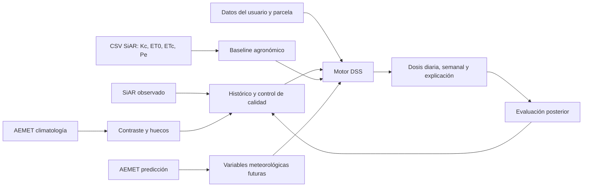

# Estrategia conjunta de datos SiAR y AEMET para el DSS de riego

## 1. Decisión de diseño

El objetivo general del TFM es desarrollar un sistema de apoyo a la decisión
capaz de recomendar riego diario y semanal para distintos cultivos y zonas de
España. Para demostrar su viabilidad se utilizará como piloto el pimiento en la
provincia de Almería.

Las dos fuentes meteorológicas tienen funciones distintas y complementarias:

- **SiAR describe lo que ha ocurrido** mediante observaciones agroclimáticas de
  estaciones orientadas al regadío y aporta una referencia agronómica de
  necesidades hídricas.
- **AEMET ayuda a anticipar lo que ocurrirá** mediante predicciones municipales
  diarias y horarias. Su climatología histórica se usará principalmente para
  contraste y cobertura de huecos.

La arquitectura propuesta separa cuatro conceptos que no deben confundirse:

1. **Observación:** meteorología medida realmente.
2. **Predicción:** meteorología que se esperaba para una fecha futura.
3. **Necesidad neta de referencia:** estimación agronómica `ET0 × Kc − Pe`.
4. **Recomendación operativa:** agua a aplicar después de considerar eficiencia,
   suelo, sistema de cultivo, riegos previos, restricciones e incertidumbre.



## 2. Datos que interesan y función dentro del proyecto

### 2.1. Datos de SiAR

| Datos | Prioridad | Parte del proyecto | Tratamiento previsto |
|---|---:|---|---|
| Fecha, estación, coordenadas, altitud y vigencia | Crítica | Selección espacial, trazabilidad y auditoría | Crear catálogo de estaciones; elegir por distancia, cobertura y similitud, no solo por provincia. |
| Códigos de validación | Crítica | Calidad del dato | Convertir en banderas de calidad. No utilizarlos como predictores. |
| `EtPMon` o ET0 | Crítica | Demanda atmosférica observada y cálculo del baseline | Unidad común mm/día; conservar valor y método de cálculo. |
| `PePMon` o precipitación efectiva | Crítica | Descuento agronómico de lluvia | No confundir con precipitación total. Revisar su validez en invernadero. |
| Precipitación total | Alta | Validación de lluvia y generación de eventos | Sumar para agregados; distinguir cero, traza, ausencia y dato inválido. |
| Temperatura media, máxima y mínima | Alta | Caracterización climática, estrés y modelos de ET0 | Comprobar rangos físicos y coherencia `mínima ≤ media ≤ máxima`. |
| Humedad media, máxima y mínima | Alta | Demanda evaporativa y control de calidad | Normalizar a porcentaje y comprobar rango 0–100. |
| Radiación solar | Crítica-alta | Cálculo y explicación de ET0 | Mantener unidad original documentada; no sustituir por índice UV. |
| Viento medio y máximo | Alta | Evapotranspiración y alertas | Homogeneizar unidades y conservar racha máxima. |
| Temperatura de suelo | Opcional | Análisis complementario | Usar solo si cobertura y profundidad están documentadas. No equivale a humedad del suelo. |
| Datos horarios | Selectiva | Estrés térmico y construcción de agregados | No descargar masivamente hasta demostrar mejora frente al dato diario. |
| Datos semanales y mensuales | Baja | Informes descriptivos | Calcularlos desde el diario para mantener una única fuente de verdad. |

### 2.2. CSV de necesidades de riego de SiAR

| Campo | Función correcta en el TFM |
|---|---|
| `Kc` | Curva de cultivo de referencia y comprobación del calendario fenológico. |
| `ET0` | Contraste con `EtPMon` obtenido por API. |
| `ETc` | Validación de que se reproduce `ET0 × Kc`. |
| `Pe` | Referencia de precipitación efectiva utilizada por SiAR. |
| `ETc - Pe` | Baseline agronómico y posible etiqueta débil, no riego óptimo observado. |

Estos CSV se conservarán completos en la capa original. En la capa analítica no
se entrenará una regresión con `ET0`, `Kc` y `Pe` para predecir `ETc - Pe`, porque
el resultado está determinado algebraicamente y produciría una falsa impresión
de precisión del modelo.

### 2.3. Datos de AEMET

| Datos | Prioridad | Parte del proyecto | Tratamiento previsto |
|---|---:|---|---|
| Fecha de elaboración, fecha válida y horizonte | Crítica | Evaluación real de predicciones | Guardar las tres dimensiones: `issued_at`, `valid_time` y `horizon`. |
| Código de municipio y coordenadas | Crítica | Relación parcela–municipio | Normalizar `id04013` y `04013`; conservar el identificador original. |
| Precipitación horaria prevista en mm | Crítica | Aplazar o reducir riego a corto plazo | Agregar por día mediante suma; mantener separada de la probabilidad. |
| Probabilidad de precipitación | Crítica | Gestión de incertidumbre | Usar como probabilidad o regla de riesgo, nunca como milímetros. |
| Temperatura horaria, máxima y mínima | Alta | Estimación futura de demanda | Agregar manteniendo máximos, mínimos y medias. |
| Humedad relativa | Alta | Estimación futura de demanda | Comprobar rango y agregar por periodo. |
| Viento y racha | Alta | Demanda evaporativa y alertas | Separar la estructura heterogénea en dirección, velocidad y racha. |
| Estado del cielo | Media | Proxy cualitativo de nubosidad | Codificar categoría y conservar descripción. No tratarlo como radiación medida. |
| Tormenta | Media | Riesgo e incertidumbre | Utilizar para avisos y moderar decisiones sensibles. |
| Orto y ocaso | Baja-media | Ventanas temporales de riego | Convertir a hora local y considerar cambio horario. |
| UV, sensación térmica y nieve | Baja o nula | Fuera del modelo principal | No usar para calcular ET0 ni para el piloto de pimiento en Almería. |
| Climatología histórica AEMET | Media | Contraste y huecos | No mezclar automáticamente con SiAR: emparejar espacialmente y marcar la fuente. |

## 3. Datos externos que siguen siendo necesarios

SiAR y AEMET no bastan para generar una dosis operativa fiable. El DSS debe
incluir o solicitar:

| Dato | Razón | Situación en el piloto |
|---|---|---|
| Cultivo y variedad | Determinan calendario y respuesta hídrica | Pimiento como cultivo piloto. |
| Fecha real de trasplante y fase fenológica | Permiten escoger el `Kc` del día | Debe introducirla el usuario o estimarse con reglas documentadas. |
| Sistema de cultivo | Distingue aire libre, malla e invernadero | **Obligatorio** para interpretar lluvia y clima exterior. |
| Curva `Kc` adecuada | Convierte ET0 en ETc | Validar si la curva SiAR representa pimiento bajo invernadero. |
| Superficie y marco de plantación | Convierte mm en litros totales o por planta | Entrada del usuario. |
| Eficiencia del riego | Convierte necesidad neta en dosis bruta | Parámetro de instalación; no debe asumirse silenciosamente. |
| Caudal y número de emisores | Convierte litros en duración del riego | Entrada de la instalación. |
| Textura, profundidad radicular y capacidad de almacenamiento | Permiten llevar un balance de agua en suelo | Segunda fase si no están disponibles. |
| Humedad de suelo o sustrato | Corrige la recomendación según el estado real | Segunda fase mediante sensores. |
| Riego aplicado y drenaje | Permiten cerrar el balance y aprender correcciones | Deben empezar a registrarse desde el piloto. |
| Producción, calidad o estrés observado | Permiten evaluar optimización agronómica real | Fase avanzada. |

## 4. Particularidades del pimiento bajo invernadero

El piloto no puede tratarse exactamente igual que un cultivo al aire libre:

1. **La precipitación exterior puede no llegar a las raíces.** Para un invernadero
   cerrado, `Pe` no debe descontarse automáticamente. Se necesita un parámetro de
   captación o entrada efectiva de lluvia. Si no existe reutilización, el valor
   inicial prudente será cero, documentándolo como supuesto.
2. **La estación mide el exterior.** Temperatura, humedad, radiación y viento de
   SiAR o AEMET no representan el microclima interior. El sistema debe mostrar
   menor confianza hasta disponer de sensores interiores.
3. **El viento exterior afecta de forma diferente.** Su efecto depende de la
   ventilación y apertura del invernadero.
4. **La curva de `Kc` y el calendario pueden diferir.** El calendario observado
   en la web de SiAR debe contrastarse con la campaña real de Almería y con la
   fecha de trasplante introducida por el usuario.

Por ello, `sistema_cultivo` será una dimensión obligatoria desde el principio,
aunque el primer prototipo solo implemente reglas específicas para invernadero.

## 5. Papel de los datos en cada módulo del TFM

### 5.1. Análisis exploratorio

- Cobertura temporal y espacial de estaciones SiAR.
- Porcentaje de ausencias y códigos de calidad por variable.
- Distribuciones, estacionalidad y extremos de ET0, radiación, temperatura,
  humedad, viento y precipitación.
- Comparación de estaciones de Almería y selección de la estación piloto.
- Verificación de la identidad `ETc = ET0 × Kc` en los CSV.
- Comparación espacial SiAR–AEMET sin asumir que ambas estaciones son iguales.

### 5.2. Baseline agronómico

El primer resultado reproducible no necesita aprendizaje automático:

```text
ETc_día = ET0_día × Kc_día
Pe_ajustada = Pe_día × coeficiente_entrada_lluvia
necesidad_neta = max(ETc_día − Pe_ajustada, 0)
dosis_bruta = necesidad_neta / eficiencia_riego
litros_totales = dosis_bruta × superficie_m2
```

Un milímetro equivale a un litro por metro cuadrado. La duración se calculará a
partir del caudal total instalado. La recomendación semanal será la suma de las
recomendaciones diarias, no un modelo independiente.

### 5.3. Predicción futura

Para los siguientes días se sustituirán las observaciones futuras, que todavía no
existen, por predicciones AEMET. El problema pendiente es la ET0 futura: la
predicción municipal no incluye radiación solar global ni ET0 directa.

Se propone esta secuencia:

1. **MVP:** utilizar el pronóstico SiAR de necesidades como comparación externa y
   una estimación reducida de ET0, explicando su incertidumbre.
2. **Modelo experimental:** estimar ET0 futura a partir de temperatura, humedad,
   viento, estacionalidad y ubicación, entrenando y validando contra ET0 observada
   de SiAR. No se afirmará que equivale a Penman–Monteith si falta radiación.
3. **Mejora futura:** incorporar una fuente de predicción con radiación o sensores
   de invernadero y recalibrar el modelo.

### 5.4. Modelo de ciencia de datos

Se distinguen tres objetivos posibles:

| Modelo | Variable objetivo | Valor científico | Recomendación |
|---|---|---|---|
| Imitación de SiAR | `ETc - Pe` del CSV | Demuestra el flujo técnico, pero aprende una etiqueta calculada | Solo prototipo y con limitación explícita. |
| Estimación de ET0 futura | ET0 SiAR observada | Permite convertir predicción meteorológica en demanda futura | Opción más defendible con los datos actuales. |
| Corrección de dosis | Diferencia entre baseline y necesidad real | Puede optimizar el riego de verdad | Mejor objetivo, pero requiere sensores, riego aplicado y respuesta del cultivo. |

Con los datos disponibles actualmente, se recomienda que el TFM combine un
**baseline agronómico explicable** con un **modelo experimental de estimación de
ET0 o necesidad futura**. El modelo corrector debe presentarse como evolución y no
simularse como si existiera una verdad de campo.

### 5.5. Motor de decisión y explicación

La salida diaria debería contener:

- necesidad neta en mm;
- dosis bruta en mm y litros;
- duración estimada del riego si se conoce el caudal;
- acumulado de los próximos siete días;
- lluvia prevista y regla aplicada;
- estación SiAR y municipio AEMET utilizados;
- fecha de elaboración y horizonte del pronóstico;
- nivel de confianza y advertencias;
- desglose explicable: ET0, `Kc`, ETc, lluvia efectiva y eficiencia.

## 6. Modelo lógico de datos

Se recomienda separar las siguientes entidades:

| Tabla o conjunto | Contenido | Clave lógica principal |
|---|---|---|
| `dim_location` | Provincia, municipio, comarca y coordenadas | `location_id` |
| `dim_station` | Fuente, código, coordenadas, altitud y vigencia | `source + station_code` |
| `dim_crop` | Cultivo, variedad y sistema de cultivo | `crop_id` |
| `dim_crop_stage` | Fase, días desde trasplante y `Kc` versionado | `crop_id + stage + version` |
| `fact_weather_observed_daily` | Meteorología SiAR/AEMET observada | `source + station + date` |
| `fact_weather_forecast` | Cada versión de la predicción | `source + municipality + issued_at + valid_time` |
| `fact_irrigation_reference` | `Kc`, ET0, ETc, Pe y necesidad SiAR | `area + crop + date + source_version` |
| `fact_irrigation_applied` | Riego real, duración, volumen y drenaje | `plot + event_time` |
| `fact_recommendation` | Recomendación, entradas, modelo y explicación | `plot + recommendation_time + valid_date` |

Toda tabla analítica debe incluir `source`, `ingested_at`, unidad, indicador de
calidad y referencia al archivo original. Las recomendaciones deben registrar la
versión de datos, reglas y modelo que las produjeron.

## 7. Organización de archivos y capas

```text
data/
├── raw/
│   ├── siar/catalogs/AAAAMMDD/
│   ├── siar/weather/daily/estacion=AL01/anio=AAAA/mes=MM/
│   ├── siar/irrigation_needs/cultivo=pimiento/zona=.../
│   ├── aemet/catalogs/AAAAMMDD/
│   ├── aemet/forecast/daily/municipio=04013/emision=.../
│   ├── aemet/forecast/hourly/municipio=04013/emision=.../
│   └── aemet/climatology/station=6325O/anio=AAAA/mes=MM/
├── interim/
│   ├── normalized/
│   ├── quality_checked/
│   └── spatial_matches/
└── processed/
    ├── training/
    ├── evaluation/
    └── dss_features/
```

- `raw` será inmutable y conservará JSON o CSV tal como se descargó.
- `interim` contendrá datos normalizados y controles de calidad.
- `processed` contendrá tablas reproducibles preparadas para análisis, modelos o
  el DSS.
- Los archivos reales no se subirán a Git. Se versionarán código, esquemas,
  diccionarios, muestras pequeñas no sensibles y metadatos de cada extracción.

## 8. Reglas de limpieza e integración

1. Convertir fechas a ISO 8601 y guardar zona horaria; no mezclar UTC y hora local.
2. Mantener por separado tiempo de emisión, tiempo válido y tiempo de ingestión.
3. Convertir comas decimales y códigos especiales sin destruir el valor original.
4. Unificar unidades antes de combinar fuentes: °C, %, m/s, mm y MJ/m² cuando
   corresponda.
5. No convertir automáticamente valores ausentes, trazas o códigos de calidad a
   cero.
6. Deduplicar por la clave lógica y conservar la versión más reciente sin borrar
   revisiones anteriores de predicciones.
7. Relacionar estaciones por distancia geográfica, altitud, entorno y periodo de
   vigencia. Guardar la distancia del emparejamiento.
8. No rellenar huecos largos con interpolación. Para huecos breves, marcar siempre
   el método y conservar una bandera `is_imputed`.
9. Aplicar controles físicos y de coherencia, pero conservar los registros
   rechazados en la capa original.
10. No mezclar precipitación total, precipitación efectiva y probabilidad de
    precipitación en una misma variable.

## 9. Frecuencia de extracción

| Proceso | Frecuencia inicial | Motivo |
|---|---|---|
| Catálogos SiAR y AEMET | Mensual y al comenzar el proyecto | Cambian poco, pero son necesarios para trazabilidad. |
| SiAR diario | Una vez al día, carga incremental | Núcleo histórico observado. |
| AEMET horaria | Dos a cuatro veces al día | Guardar cambios de pronóstico sin agotar cuota. |
| AEMET diaria | Dos veces al día | Planificación de varios días. |
| AEMET climatología | Semanal o para cubrir periodos | Fuente secundaria con retraso de publicación. |
| CSV de necesidades SiAR | Carga inicial y cuando cambie configuración | Baseline y validación, no flujo operativo principal. |
| Datos de parcela y riego aplicado | En cada evento | Necesarios para evolucionar hacia optimización real. |

Se consultarán los límites de las APIs, se utilizará caché y se aplicarán reintentos
con espera ante respuestas `429`.

## 10. Entrenamiento y evaluación

La partición debe ser temporal, nunca aleatoria:

- entrenamiento con el periodo más antiguo;
- validación con un periodo posterior;
- prueba final con el tramo más reciente;
- si hay suficientes estaciones, una prueba adicional dejando una estación fuera
  para medir capacidad de generalización espacial.

Métricas técnicas recomendadas:

- MAE y RMSE de ET0 o necesidad en mm/día;
- sesgo medio para detectar sobre-riego o infra-riego sistemático;
- error por horizonte D+1, D+2, etc.;
- error acumulado semanal;
- cobertura de intervalos de incertidumbre.

Métricas del DSS:

- litros recomendados frente al baseline;
- porcentaje de recomendaciones anuladas o reducidas por lluvia;
- episodios de recomendación negativa o fuera de límites, que deben ser cero;
- ahorro potencial de agua sin aumentar indicadores de estrés;
- cumplimiento de restricciones agronómicas y operativas.

Sin riego aplicado, sensores o respuesta del cultivo solo podrá evaluarse la
coherencia meteorológica y la reproducción de una referencia, no afirmar que se
ha demostrado un ahorro real de agua.

## 11. Alcance recomendado para llegar a tiempo

Para el piloto se recomienda:

1. Pimiento bajo invernadero como único cultivo.
2. Provincia de Almería, empezando por `AL01` La Mojonera y ampliando solo a las
   estaciones con buena cobertura.
3. Resolución diaria como núcleo del modelo y salida semanal derivada.
4. Histórico diario de SiAR como fuente principal.
5. Predicción diaria AEMET y horaria para las primeras 48 horas.
6. CSV SiAR de pimiento como baseline de validación.
7. Reglas explícitas para eficiencia y entrada de lluvia en invernadero.
8. Registro desde ahora de cada predicción AEMET y, si es posible, de riegos reales.

La estructura seguirá siendo extensible a cualquier cultivo y zona mediante
catálogos, parámetros y curvas `Kc`, pero no es necesario descargar y modelar todo
el territorio nacional para demostrar correctamente el TFM.

## 12. Conclusión

El valor del proyecto no consiste en juntar todas las columnas disponibles, sino
en asignar a cada dato una función correcta. SiAR proporciona el histórico y el
baseline agronómico; AEMET aporta anticipación; los datos de cultivo y parcela
convierten milímetros en una actuación; y los datos reales de riego y respuesta
del cultivo permitirán, en una fase posterior, aprender una corrección realmente
inteligente.

El resultado defendible para el TFM es un DSS híbrido: reglas agronómicas
explicables, predicción meteorológica, un modelo experimental claramente acotado
y trazabilidad completa de cada recomendación.
