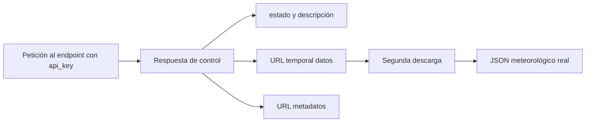

# Inventario y selección de datos de AEMET OpenData

## 1. Función de AEMET en el DSS

AEMET complementará a SiAR principalmente con predicciones meteorológicas. SiAR aporta observaciones agroclimáticas y el baseline de necesidades hídricas; AEMET permite anticipar lluvia, temperatura, humedad y viento para generar recomendaciones futuras.

Fuentes oficiales consultadas:

- [Documentación dinámica AEMET OpenData v2.0](https://opendata.aemet.es/dist/)
- [Especificación OpenAPI oficial](https://opendata.aemet.es/AEMET_OpenData_specification.json)
- [Centro de descargas AEMET OpenData](https://opendata.aemet.es/centrodedescargas/inicio)

## 2. Funcionamiento técnico

La URL base es `https://opendata.aemet.es/opendata/api`. La API key se envía en la cabecera HTTP `api_key` y se almacena localmente en la variable `AEMET_API_KEY` del fichero `.env`.

La descarga se realiza normalmente en dos pasos:

La clave solo se envía a la primera petición. El cliente valida que la URL de descarga pertenece a un dominio oficial de AEMET antes de seguirla.

## 3. Endpoints seleccionados

| Producto | Endpoint | Prioridad | Uso |
|---|---|---:|---|
| Catálogo de municipios | `/maestro/municipios` | Alta | Relacionar ubicación del usuario con el código municipal requerido por las predicciones. |
| Predicción diaria municipal | `/prediccion/especifica/municipio/diaria/{municipio}` | Crítica | Recomendación de riego para varios días. |
| Predicción horaria municipal | `/prediccion/especifica/municipio/horaria/{municipio}` | Alta | Detalle de hasta 48 horas para lluvia, temperatura y viento. |
| Predicción diaria de todos los municipios | `/prediccion/especifica/municipio/diaria/todos` | Media | Descarga masiva si se escala el DSS a todo el país. Endpoint incorporado en 2026. |
| Predicción horaria de todos los municipios | `/prediccion/especifica/municipio/horaria/todos` | Baja-media | Útil a gran escala, pero genera mucho volumen. Endpoint incorporado en 2026. |
| Inventario de estaciones | `/valores/climatologicos/inventarioestaciones/todasestaciones` | Alta | Coordenadas, altitud, provincia e identificadores AEMET. |
| Climatología diaria histórica | `/valores/climatologicos/diarios/datos/fechaini/{inicio}/fechafin/{fin}/estacion/{idema}` | Media | Complementar, contrastar o cubrir huecos de SiAR. |
| Observaciones de las últimas 12 horas | `/observacion/convencional/datos/estacion/{idema}` | Media-baja | Monitorización reciente; SiAR seguirá siendo la fuente observacional principal del piloto. |
| Avisos meteorológicos | `/avisos_cap/ultimoelaborado/area/{area}` | Opcional | Regla de seguridad ante fenómenos adversos. |
| Balance hídrico nacional | `/productos/climatologicos/balancehidrico/{anio}/{decena}` | Baja | Producto documental agregado; no sustituye el balance de parcela. |
| NDVI por satélite | `/satelites/producto/nvdi` | Baja | Producto gráfico general, no una serie parcelaria lista para el modelo. |

## 4. Datos relevantes de la predicción municipal

Se realizó una prueba real el **23/09/2026** con el municipio de Almería
(`04013`). La consulta diaria devolvió un registro municipal con **siete días** de
predicción y la horaria devolvió el día en curso más los periodos necesarios para
cubrir aproximadamente **48 horas**. El registro raíz contiene `elaborado`, `id`,
`nombre`, `provincia`, `version`, `origen` y `prediccion`.

### 4.1. Predicción diaria

Cada día incluye los siguientes grupos: `fecha`, `probPrecipitacion`,
`estadoCielo`, `viento`, `rachaMax`, `temperatura`, `sensTermica`,
`humedadRelativa`, `cotaNieveProv` y, cuando corresponde, `uvMax`.

| Grupo | Contenido observado | Decisión para el DSS |
|---|---|---|
| Trazabilidad | Fecha de elaboración, municipio, fecha prevista y versión | **Conservar.** Permite distinguir D+1, D+2, etc. y reproducir recomendaciones. |
| Precipitación | Probabilidad por periodos del día | **Crítica.** Se utilizará como probabilidad, nunca como si fueran milímetros. |
| Temperatura | Máxima, mínima y valores por horas o periodos | **Crítica.** Indicador de demanda evaporativa y estrés térmico. |
| Humedad relativa | Máxima, mínima y evolución por periodos | **Alta.** Útil para caracterizar la demanda atmosférica. |
| Viento y rachas | Dirección y velocidad por periodos; racha máxima | **Alta.** Afecta a la evapotranspiración y puede activar alertas. |
| Estado del cielo | Código y descripción por periodo | **Secundaria.** Puede servir como aproximación cualitativa a la nubosidad. |
| Índice UV máximo | `uvMax` | **No usar para ET0.** No es radiación solar global. |
| Sensación térmica | Máxima, mínima y valores por periodo | **Excluir del modelo principal.** Está orientada a percepción humana. |
| Nieve | Cota prevista | **Excluir en el piloto.** No aporta valor para pimiento en Almería. |

En el primer día pueden aparecer ceros o cadenas vacías para periodos que ya han
pasado a la hora de elaboración. La transformación deberá filtrar los periodos
anteriores a `elaborado` para no interpretarlos como una predicción de valor cero.

### 4.2. Predicción horaria

Cada bloque diario observado contiene `fecha`, `orto`, `ocaso`, `temperatura`,
`sensTermica`, `humedadRelativa`, `precipitacion`, `probPrecipitacion`,
`probTormenta`, `nieve`, `probNieve`, `estadoCielo` y `vientoAndRachaMax`.

| Campo | Significado | Decisión para el DSS |
|---|---|---|
| `precipitacion` | Cantidad de precipitación prevista por hora, en mm | **Crítica** para descontar o aplazar riego a corto plazo. |
| `probPrecipitacion` | Probabilidad de precipitación por intervalo | **Crítica**, manteniéndola separada de la cantidad prevista. |
| `temperatura` | Temperatura prevista por hora, en °C | **Crítica.** |
| `humedadRelativa` | Humedad relativa prevista por hora, en % | **Alta.** |
| `vientoAndRachaMax` | Serie intercalada de viento y racha máxima | **Alta**, pero requiere transformación específica. |
| `probTormenta` | Probabilidad de tormenta por intervalo | **Secundaria**, útil como señal de riesgo e incertidumbre. |
| `estadoCielo` | Código y descripción del cielo | **Secundaria.** |
| `orto` / `ocaso` | Hora local de salida y puesta del sol | **Secundaria**, útil para definir ventanas diurnas. |
| Nieve y sensación térmica | Valores horarios o probabilidades | **Excluir** en el modelo principal del piloto. |

`vientoAndRachaMax` no es una tabla homogénea: intercala objetos con `direccion`
y `velocidad` y objetos con `value` para la racha. Antes de modelar deberá
separarse en columnas de dirección, velocidad y racha, asociadas a su periodo.

| Grupo | Campos o conceptos | Decisión |
|---|---|---|
| Identificación | Municipio, provincia, código, fecha de elaboración | Conservar para trazabilidad. |
| Tiempo | Fecha y periodo horario | Imprescindible. |
| Precipitación | Probabilidad y, en productos horarios, cantidad prevista cuando esté disponible | Crítica para anticipar riegos. La probabilidad no debe confundirse con milímetros. |
| Temperatura | Máxima, mínima y valores por periodo | Crítica. |
| Humedad relativa | Máxima, mínima y valores horarios | Alta. |
| Viento | Dirección, velocidad y rachas | Alta para estimar demanda evaporativa. |
| Estado del cielo | Código y descripción | Secundario; puede apoyar una estimación de radiación. |
| Sensación térmica | Máxima, mínima y valores horarios | Baja para riego; orientada a percepción humana. |
| Cota de nieve y nieve | Cota y cantidad | No relevante para el piloto de Almería. |
| Probabilidad de tormenta | Probabilidad por periodo | Secundaria como indicador de incertidumbre y riesgo. |
| Índice ultravioleta | `uvMax` cuando esté disponible | No equivale a radiación solar global; no se usará para calcular ET0. |

La predicción diaria municipal es la fuente principal para el horizonte de varios días. La horaria se utilizará para las primeras 48 horas y para estimar mejor el momento de lluvia o viento fuerte.

## 5. Catálogos geográficos verificados

La prueba devolvió **8.122 municipios**. El registro municipal contiene `id`,
`id_old`, `nombre`, `capital`, `altitud`, latitud y longitud tanto en formato
textual como decimal, población, URL y zona comarcal. Para Almería se obtuvo
`id04013`, latitud decimal `36.83892362`, longitud decimal `-2.46413188` y
altitud de 16 m.

El endpoint de predicción aceptó `04013`, mientras que el catálogo lo representa
como `id04013`. La capa de integración deberá eliminar el prefijo `id` al formar
la URL y conservar ambas representaciones para trazabilidad.

El inventario devolvió **926 estaciones**, de las cuales **21 pertenecen a la
provincia de Almería**. Cada estación contiene `indicativo`, `indsinop`, `nombre`,
`provincia`, `altitud`, `latitud` y `longitud`. Entre las estaciones relevantes
aparecen:

| Indicativo | Estación | Posible uso |
|---|---|---|
| `6325O` | Almería Aeropuerto | Serie histórica completa y referencia costera. |
| `6297` | Almería | Referencia del entorno urbano/costero. |
| `6291B` | El Ejido | Especialmente relevante para agricultura intensiva del Poniente. |
| `6293X` | Roquetas de Mar | Referencia del Poniente almeriense. |
| `6329X` | Cabo de Gata | Referencia costera oriental. |

No se debe unir una estación AEMET con una estación SiAR solo por provincia. Se
calculará la distancia geográfica y se conservarán coordenadas, altitud y distancia
de emparejamiento. Algunos nombres del catálogo presentaron caracteres de
reemplazo; se conservará el texto original y se podrá añadir un nombre normalizado
mediante una tabla de correspondencias controlada.

## 6. Climatología diaria histórica

La prueba real para la estación `6325O` (Almería Aeropuerto), del 15/09/2026 al
20/09/2026, devolvió seis registros. El producto tiene periodicidad diaria y la
documentación oficial indica un retraso aproximado de cuatro días.

Los registros observados incluyeron:

| Campos | Significado y unidad | Prioridad |
|---|---|---|
| `fecha`, `indicativo`, `nombre`, `provincia`, `altitud` | Identificación espacial y temporal; altitud en m | **Conservar.** |
| `tmed`, `tmin`, `tmax`, `horatmin`, `horatmax` | Temperaturas en °C y horas UTC de extremos | **Alta.** |
| `prec` | Precipitación acumulada diaria entre 07–07 UTC, en mm | **Crítica** como observación meteorológica. |
| `velmedia`, `dir`, `racha`, `horaracha` | Velocidad media y racha en m/s; dirección de la racha en decenas de grado; hora UTC | **Alta.** |
| `hrMedia`, `hrMin`, `hrMax`, horas asociadas | Humedad relativa en % | **Alta.** |
| `sol` | Duración de insolación, en horas | **Media-alta**, útil como proxy histórico de radiación. |
| `presMin`, `presMax`, horas asociadas | Presión en hPa | **Baja-media** para el primer modelo. |
| `pintMax` y hora asociada | Intensidad máxima de precipitación, en mm/h | **Media**, útil para caracterizar eventos fuertes. |

Muchos valores se sirven como texto y utilizan coma decimal. Además, `Ip` indica
precipitación inapreciable inferior a 0,1 mm y `Acum` un valor acumulado; estos
códigos no deben convertirse ciegamente a cero. En dirección de racha, `99`
significa variable y `88` dato faltante. En intensidad, `-0,3` representa una
traza inferior a 0,1 mm/h. La capa de transformación conservará el valor original,
creará una columna numérica y otra columna de calidad o estado.

La capitalización de algunos campos en los datos (`presMax`, `hrMedia`) difiere de
la utilizada en los metadatos (`presmax`, `hrmedia`). El normalizador deberá
tratar los nombres sin distinguir mayúsculas y minúsculas.

Para el piloto, estos datos se usarán para contrastar y cubrir huecos, no para sustituir los históricos diarios de SiAR. Las estaciones de ambas redes no tienen por qué estar en el mismo lugar, por lo que la unión se realizará por proximidad espacial y fecha, conservando siempre la distancia entre estaciones.

## 7. Qué no proporciona directamente AEMET OpenData

Los endpoints municipales públicos seleccionados no proporcionan directamente:

- necesidades hídricas del cultivo;
- coeficiente de cultivo `Kc`;
- evapotranspiración del cultivo `ETc`;
- precipitación efectiva agronómica `Pe`;
- humedad del suelo o del sustrato;
- dosis, duración o frecuencia del riego;
- radiación solar global prevista como variable numérica en la predicción municipal estándar;
- ET0 prevista como campo directo en la predicción municipal estándar.

Por tanto, AEMET no genera por sí sola la recomendación. Sus predicciones alimentarán el motor agronómico junto con `Kc`, estado del cultivo y datos de SiAR.

## 8. Implicación para el cálculo futuro de ET0

La ecuación FAO Penman-Monteith necesita temperatura, humedad, viento y radiación. La predicción municipal aporta buena parte de estas variables, pero no siempre incluye radiación solar global numérica. Se contemplan tres alternativas, ordenadas de menor a mayor complejidad:

1. Usar el pronóstico de necesidades netas de SiAR como comparación externa.
2. Estimar ET0 con un método de variables reducidas, como Hargreaves-Samani, dejando clara su menor precisión.
3. Incorporar en una fase posterior una fuente de predicción numérica que proporcione radiación y las variables necesarias para Penman-Monteith.

No se utilizará el índice UV como sustituto directo de la radiación solar global.

## 9. Estrategia para el piloto

1. Obtener el código INE/AEMET del municipio asociado a la parcela o estación SiAR.
2. Descargar la predicción diaria municipal.
3. Descargar la predicción horaria para las siguientes 48 horas.
4. Normalizar periodos, unidades y fechas de elaboración.
5. Derivar características diarias: temperaturas, humedad, viento, probabilidad y cantidad prevista de lluvia.
6. Combinar las predicciones con el calendario y `Kc` del pimiento.
7. Calcular una necesidad futura provisional y mostrar su incertidumbre.
8. Guardar cada predicción junto con su fecha de elaboración para poder evaluar posteriormente el error frente a las observaciones reales de SiAR.

Es esencial guardar la fecha de elaboración, no solo la fecha pronosticada. De este modo se podrá medir cómo cambia la precisión según el horizonte: D+1, D+2, etc.

AEMET OpenData ofrece la predicción vigente, no un archivo completo de todas las
predicciones que se publicaron en el pasado. Por ello, si el modelo debe aprender
o evaluarse usando pronósticos, será necesario ejecutar una descarga programada y
guardar cada versión desde el inicio. La climatología histórica representa el
tiempo que ocurrió; no sustituye al histórico de pronósticos.

## 10. Resultado del test técnico

| Prueba | Resultado |
|---|---|
| Autenticación mediante `AEMET_API_KEY` | Correcta. |
| Descarga en dos pasos | Correcta. |
| Municipio `04013` | Predicción diaria y horaria obtenidas. |
| Catálogo de municipios | 8.122 registros obtenidos. |
| Inventario de estaciones | 926 estaciones; 21 en Almería. |
| Climatología de `6325O` | Seis días solicitados y recibidos. |
| Protección de la clave | La clave no aparece en la URL ni en los mensajes de error. |
| Límite de uso | Se observó `HTTP 429` al repetir consultas; requiere caché, espera y reintento limitado. |

Las pruebas unitarias del cliente se ejecutan sin consumir cuota y cubren la
descarga en dos pasos, la construcción de URLs, el rechazo de destinos no
oficiales, la ocultación de la clave y la codificación histórica de algunos
productos.

## 11. Seguridad y mantenimiento

- `AEMET_API_KEY` nunca se incluirá en Git ni en mensajes de error.
- Se controlarán respuestas HTTP 401, 403, 404 y 429.
- Se aplicarán reintentos limitados y caché para evitar descargas repetidas.
- Se vigilarán los comunicados de AEMET OpenData. Las claves nuevas tienen una validez de tres meses y AEMET ha anunciado que las claves antiguas sin fecha de expiración dejarán de ser válidas el 15/10/2026.
- Se citará a AEMET como autora de los datos conforme a sus condiciones de reutilización.

## 12. Conclusión

Para el DSS, el mayor valor de AEMET es predictivo. La predicción diaria permitirá planificar el riego de los próximos días y la horaria refinará las primeras 48 horas. SiAR seguirá aportando el histórico agroclimático, ET0 observada, precipitación efectiva y las necesidades netas de referencia. Ambas fuentes se complementan y deberán conservar identificadores, coordenadas, fecha observada, fecha de elaboración y horizonte para mantener la trazabilidad.
