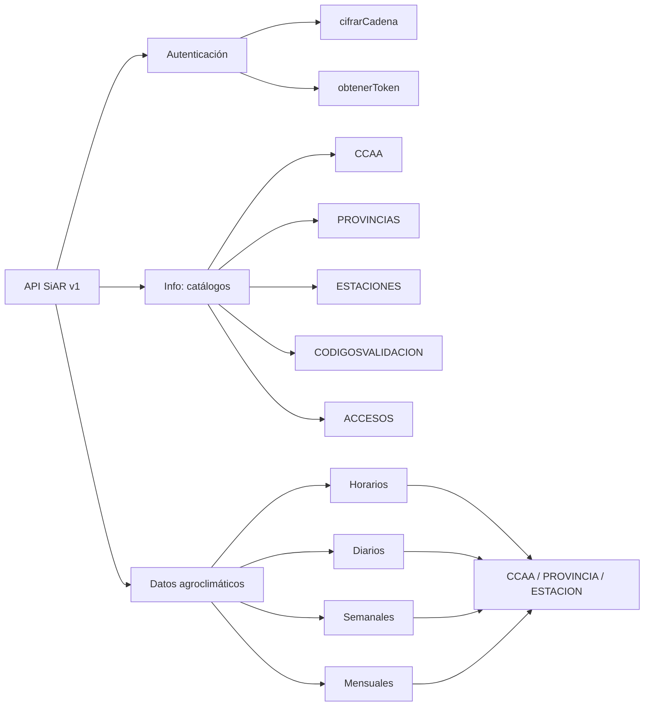

# Inventario y selección de datos de la API SiAR

## 1. Objetivo

Este documento inventaría la información disponible en la API del Sistema de Información Agroclimática para el Regadío (SiAR) y decide qué datos se incorporarán al DSS de recomendación de riego. El piloto se centra en pimiento cultivado en la provincia de Almería, pero el diseño conserva códigos geográficos y de estación para poder ampliarlo a otros cultivos y zonas de España.

La fuente principal es el [Manual Web API SiAR, versión 2.2 (mayo de 2025)](https://servicio.mapa.gob.es/siarweb/documentos/manuales/ManualTecnico_WEB_API_SIAR.pdf). Los campos diarios también se han contrastado el 23/09/2026 mediante una consulta real de la estación `AL01` (La Mojonera).

## 2. Mapa general de la API



URL base de producción: `https://servicio.mapa.gob.es/siarapi/API/V1`.

Todas las respuestas de los servicios de información y datos son JSON y tienen, de forma general, una lista `datos` y un campo `MensajeRespuesta`. El token se envía como parámetro de consulta porque así lo exige la API, pero debe mantenerse exclusivamente en el fichero local `.env`.

## 3. Servicios de autenticación

| Servicio | Finalidad | Uso en el DSS |
|---|---|---|
| `Autenticacion/cifrarCadena` | Cifra por separado el identificador y la contraseña del usuario. | Solo administración de credenciales. No genera datos para el modelo. |
| `Autenticacion/obtenerToken` | Obtiene el token a partir de las credenciales cifradas. | Solo administración. En la primera versión utilizaremos un token ya emitido y almacenado en `.env`. |

No se almacenarán en Git ni el token, ni el identificador, ni la contraseña. Tampoco se registrará la URL completa de una petición, porque contiene el token.

## 4. Servicio `Info`: catálogos y metadatos

Endpoint: `GET /Info/{PeticionInfo}?token=...`

| Petición | Campos devueltos | Utilidad | Decisión |
|---|---|---|---|
| `CCAA` | `CCAA`, `Codigo` | Permite seleccionar una comunidad y obtener el código requerido por otras consultas. | Conservar como catálogo de referencia. |
| `PROVINCIAS` | `Provincia`, `Codigo`, `Codigo_CCAA`, `IdProvincia` | Relaciona provincias con comunidades y aporta sus identificadores. | Conservar. Necesario para seleccionar Almería y generalizar el DSS. |
| `ESTACIONES` | `Estacion`, `Codigo`, `Termino`, `Longitud`, `Latitud`, `Altitud`, `XUTM`, `YUTM`, `Huso`, `Fecha_Instalacion`, `Fecha_Baja`, `Red_Estacion`, `IdProvincia`, `IdEstacion` | Localización, vigencia y procedencia de cada estación. Permite asignar la estación más representativa a una parcela. | Imprescindible. Actualización ocasional. |
| `CODIGOSVALIDACION` | `Descripcion`, `IdCodigoValidacion` | Explica si una medida es válida, nula, editada o presenta anomalías de sensor o consistencia. | Imprescindible para control de calidad, aunque no es una variable predictora. |
| `ACCESOS` | Contadores y máximos de peticiones y registros por minuto y día. | Permite evitar bloqueos por exceso de cuota. | Solo monitorización técnica. No se almacena como dato agrícola. |

### 4.1 Límites observados con el token actual

La consulta realizada el 23/09/2026 informó de los siguientes máximos:

| Concepto | Límite |
|---|---:|
| Peticiones por minuto | 100 |
| Peticiones por día | 1.000 |
| Registros por minuto | 100 |
| Registros por día | 10.000 |

Los límites pertenecen al token y podrían cambiar. El proceso de extracción debe consultar `Info/ACCESOS`, dividir las descargas en lotes pequeños y aplicar espera y reintentos controlados.

## 5. Servicio `Datos`: parámetros de consulta

Endpoint: `GET /Datos/{tipoDatos}/{ambito}`

### 5.1 Dimensiones disponibles

| Dimensión | Valores | Recomendación |
|---|---|---|
| `tipoDatos` | `Horarios`, `Diarios`, `Semanales`, `Mensuales` | Usar `Diarios` como fuente principal y `Horarios` solo para análisis específicos. |
| `ambito` | `CCAA`, `PROVINCIA`, `ESTACION` | Usar `ESTACION`; los agregados territoriales pueden ocultar diferencias locales importantes. |

El manual describe además una estructura denominada `Diarios2` para calmas e intervalos térmicos, pero no la incluye entre los valores admitidos de `tipoDatos`. Debe considerarse una funcionalidad no confirmada y no formará parte del primer ETL.

### 5.2 Parámetros

| Parámetro | Obligatorio | Descripción |
|---|---|---|
| `token` | Sí | Credencial personal. Nunca se guarda en el repositorio. |
| `Id` | Sí | Uno o varios códigos de CCAA, provincia o estación. Para varias entidades se repite `Id`. |
| `FechaInicial` | Sí | Inicio en formato `YYYY-MM-DD`. |
| `FechaFinal` | Sí | Fin en formato `YYYY-MM-DD`. |
| `FechaUltModificacion` | No | Permite limitar por la fecha de modificación y facilitar cargas incrementales. Debe validarse su comportamiento antes de usarla en producción. |
| `DatosCalculados` | No | Si es `true`, añade variables calculadas en datos diarios, semanales y mensuales. |

El acceso histórico depende de la autorización asociada al token. En la prueba actual, `2025-01-01` fue rechazado por ser anterior a la fecha mínima autorizada, mientras que fechas de septiembre y diciembre de 2025 sí fueron aceptadas. Antes de entrenar modelos se debe confirmar o ampliar el intervalo histórico permitido.

## 6. Diccionario de datos agroclimáticos

### 6.1 Datos horarios

| Campo | Significado | Relevancia para el DSS |
|---|---|---|
| `Fecha` | Fecha del registro. | Alta: eje temporal. |
| `Estacion` | Código de estación. | Alta: trazabilidad y unión con el catálogo. |
| `HorMin` | Hora y minuto en formato `HHMM`. | Alta si se modela a escala horaria. |
| `TempMedia` | Temperatura media del aire. | Alta. |
| `HumedadMedia` | Humedad relativa media. | Alta. |
| `VelViento` | Velocidad media del viento. | Alta para estimar demanda evaporativa. |
| `DirViento` | Dirección media del viento. | Baja-media; puede ayudar a detectar patrones locales. |
| `Radiacion` | Radiación solar. | Alta; variable clave de evapotranspiración. |
| `Precipitacion` | Precipitación acumulada. | Alta. |
| `TempSuelo1`, `TempSuelo2` | Temperatura del suelo a dos niveles. | Media; disponibilidad desigual entre estaciones. |
| `IdProvincia`, `IdEstacion` | Identificadores internos. | Alta para integridad y relaciones entre tablas. |

Los horarios aumentan mucho el volumen de datos. En el piloto se conservarán como opción para estudiar estrés térmico o construir agregados propios, pero no son necesarios para la primera recomendación diaria/semanal.

### 6.2 Datos diarios

| Grupo | Campos | Relevancia |
|---|---|---|
| Identificación | `Fecha`, `Estacion` | Imprescindibles. Forman la clave lógica del registro. |
| Temperatura | `TempMedia`, `TempMax`, `HorMinTempMax`, `TempMin`, `HorMinTempMin` | Media, máxima y mínima: imprescindibles. Las horas de los extremos son secundarias. |
| Humedad | `HumedadMedia`, `HumedadMax`, `HorMinHumMax`, `humedadMin`, `HorMinHumMin` | Valores de humedad: alta relevancia. Horas: secundarias. La API real usa `humedadMin` con minúscula inicial. |
| Viento | `VelViento`, `DirViento`, `VelVientoMax`, `HorMinVelMax`, `DirVientoVelMax` | Velocidad media y máxima: relevantes. Dirección y hora del máximo: secundarias. |
| Energía y agua | `Radiacion`, `Precipitacion` | Imprescindibles. |
| Suelo | `TempSuelo1`, `TempSuelo2` | Opcionales por cobertura irregular y porque no sustituyen a la humedad del suelo. |
| Identificadores | `IdProvincia`, `IdEstacion` según el manual | Útiles para relaciones. No aparecieron en la respuesta diaria real de `AL01`; debe admitirse que sean opcionales. |
| Calculados | `EtPMon`, `PePMon` cuando `DatosCalculados=true` | Imprescindibles. Son la evapotranspiración de referencia y la precipitación efectiva. |
| Calidad observada | `CodTempSuelo1`, `CodTempSuelo2` | Usar para filtrar o marcar datos dudosos; no como predictores. Estos campos aparecieron en la respuesta real aunque el cuadro diario del manual no los detalla. |

Para el DSS, la aproximación agronómica inicial será:

`necesidad_neta = ET0 × Kc − precipitación_efectiva`

donde `ET0` procede de `EtPMon`, `Kc` depende del cultivo y su fase fenológica, y la precipitación efectiva puede proceder de `PePMon`. La dosis bruta debe ajustar además la eficiencia del sistema de riego y, cuando estén disponibles, el balance de humedad del suelo y las restricciones operativas.

### 6.3 Datos semanales

Campos: `Año`, `Semana`, `Estacion`, estadísticas de temperatura y humedad, día/hora de los extremos, velocidad y dirección del viento, radiación acumulada y precipitación acumulada. Con `DatosCalculados=true` añade `EtPMon` y `PePMon`.

Son útiles para informes y para presentar la recomendación semanal, pero no se descargarán en el ETL inicial: se agregarán los datos diarios para mantener una única fuente de verdad y controlar las reglas de agregación.

### 6.4 Datos mensuales

Campos: `Año`, `Mes`, `Estacion`, estadísticas de temperatura y humedad, día/hora de extremos, viento, radiación y precipitación. Con `DatosCalculados=true` añade `EtPMon` y `PePMon`.

Son adecuados para análisis climático descriptivo y comparación histórica, pero resultan demasiado agregados para decidir el riego diario. Se calcularán desde los datos diarios cuando sean necesarios.

### 6.5 Estructura `Diarios2` descrita en el manual

Incluye `IdProvincia`, `IdEstacion`, `Año`, `Dia`, recuentos de `Calmas` y `NoCalmas`, y horas o proporciones en diferentes intervalos de temperatura. Puede servir para estudios de horas frío, estrés térmico o episodios agroclimáticos. No es prioritaria para calcular la dosis de riego y su disponibilidad como ruta de API debe verificarse.

## 7. Necesidades netas de riego de la web SiAR

Además de la Web API documentada, SiAR dispone de la sección pública [Cálculo de necesidades netas](https://servicio.mapa.gob.es/siarweb/necesidadesHidricas/inicio). Esta funcionalidad es muy relevante para el TFM porque combina los datos agroclimáticos con el cultivo y proporciona una estimación diaria, semanal o mensual de sus necesidades hídricas.

### 7.1 Entradas del cálculo

| Entrada | Función |
|---|---|
| Comunidad, provincia y estación | Determinan los datos agroclimáticos utilizados. |
| Comarca | Determina los cultivos y calendarios disponibles. SiAR propone la comarca de la estación, aunque permite cambiarla. |
| Cultivo | Selecciona el calendario de cultivo y la curva del coeficiente `Kc`. |
| Tipo de datos | Diario, semanal o mensual. |
| Fechas | Delimitan el periodo histórico calculado. |

La prueba realizada para la estación `AL02` (Almería), comarca Campo Níjar-Bajo Andarax, mostró 45 cultivos configurados. Para pimiento, SiAR identifica un ciclo de riego de mayo a septiembre.

### 7.2 Salidas

| Campo | Significado | Papel en el DSS |
|---|---|---|
| `Fecha` | Día, semana o mes del cálculo. | Clave temporal. |
| `Kc` | Coeficiente del cultivo para el momento de su ciclo. | Parámetro agronómico esencial. |
| `ET0` | Evapotranspiración de referencia de la estación, en mm. | Demanda atmosférica. |
| `ETc` | Evapotranspiración estimada del cultivo, en mm. | Demanda hídrica del cultivo. |
| `Pe` | Precipitación efectiva, en mm. | Aporte de lluvia aprovechable. |
| `ETc - Pe` | Necesidad neta estimada, sin permitir valores negativos. | Baseline o referencia agronómica. |

La lógica reproducible es:

```text
ETc = ET0 × Kc
necesidad_neta = max(ETc − Pe, 0)
```

La web muestra también el valor medio de `Kc` y los acumulados de `ET0`, `ETc`, `Pe` y necesidad neta para todo el periodo. Los resultados pueden descargarse en CSV y PDF.

### 7.3 Qué son y qué no son estos datos

Estos resultados son una **estimación agronómica calculada**, no una medición del riego realmente aplicado ni de la respuesta real de la planta. El propio manual de SiAR indica que solo considera las condiciones climáticas y el cultivo; no incorpora:

- propiedades del suelo o sustrato;
- humedad actual del suelo;
- calidad del agua;
- eficiencia, caudal o uniformidad del sistema de riego;
- fecha real de trasplante y fase fenológica observada;
- prácticas de cultivo, riegos anteriores o drenaje;
- microclima interior del invernadero;
- producción, calidad o estrés real de la planta.

Por tanto, la necesidad neta de SiAR se usará como **baseline, etiqueta débil y referencia de validación agronómica**, pero no se presentará como la dosis óptima observada.

### 7.4 Riesgo de fuga de información al entrenar

Si la variable objetivo es `ETc - Pe` y se introducen simultáneamente `ET0`, `Kc` y `Pe` como predictores, el modelo solo aprenderá a reproducir una fórmula que ya conocemos. Esto produciría métricas artificialmente altas sin aportar inteligencia nueva.

Se plantean dos experimentos diferentes:

1. **Baseline determinista:** calcular directamente `max(ET0 × Kc − Pe, 0)`. No necesita aprendizaje automático y debe ser siempre el punto de comparación.
2. **Modelo corrector o avanzado:** aprender el ajuste respecto al baseline utilizando sensores de suelo/invernadero, estado fenológico, riegos aplicados y resultados agronómicos. Este sí puede aportar valor, pero requiere datos de campo adicionales.

Si todavía no existen datos reales de campo, puede construirse un modelo demostrativo con las necesidades SiAR como etiqueta, dejando claro que se trata de imitar el método SiAR y evitando afirmar que predice el riego óptimo real.

### 7.5 Acceso técnico y estrategia de integración

El manual oficial de la Web API v2.2 no documenta un endpoint público específico para las necesidades netas. La web ofrece descargas CSV/PDF y utiliza internamente rutas ligadas a una sesión web y a protección CSRF, entre ellas `necesidadesHidricasRest/calculoJSON` y `exportCSV`. Al no constituir un contrato público de API, automatizar esas rutas sería frágil ante cambios de la página.

La estrategia recomendada es:

1. Descargar muestras CSV oficiales para documentar y validar el cálculo.
2. Obtener `ET0` y `Pe` mediante la API oficial de datos diarios.
3. Construir y versionar una tabla explícita de calendarios y curvas `Kc` por cultivo y comarca, con su fuente y versión.
4. Reproducir la fórmula en nuestro código y contrastarla con los CSV de SiAR mediante pruebas automáticas.
5. Mantener separadas la necesidad neta, la dosis bruta y la recomendación final:

```text
necesidad_neta = max(ET0 × Kc − Pe, 0)
dosis_bruta = necesidad_neta / eficiencia_riego
recomendacion_final = ajuste(dosis_bruta, humedad_suelo, pronostico, restricciones)
```

### 7.6 Pronóstico de necesidades netas

La misma web ofrece un pronóstico diario para los siguientes seis días. Según el manual de SiAR, se calcula con el pronóstico de `ET0` y precipitación procedente de AEMET. Este producto será útil para comparar nuestro futuro módulo AEMET, pero no sustituye la integración propia porque necesitamos controlar las variables, el horizonte, la trazabilidad y las reglas del DSS.

## 8. Selección para el DSS

### 8.1 Variables que sí se incorporarán

| Prioridad | Datos | Motivo |
|---|---|---|
| Crítica | `Fecha`, `Estacion`, metadatos y coordenadas de estación | Trazabilidad, proximidad espacial y reproducibilidad. |
| Crítica | `EtPMon` | Base de la demanda atmosférica de agua. |
| Crítica | `PePMon` y `Precipitacion` | Aporte hídrico natural y contraste del cálculo efectivo. |
| Alta | `TempMedia`, `TempMax`, `TempMin` | Demanda evaporativa, estrés térmico y fenología. |
| Alta | `HumedadMedia`, `HumedadMax`, `humedadMin` | Demanda evaporativa y condiciones ambientales. |
| Alta | `Radiacion` | Componente fundamental de la evapotranspiración. |
| Alta | `VelViento`, `VelVientoMax` | Influye en evapotranspiración y ventilación del cultivo. |
| Alta | Códigos de validación disponibles | Evitar entrenar o recomendar con mediciones defectuosas. |
| Media | `TempSuelo1`, `TempSuelo2` | Variable complementaria cuando no sea nula y su profundidad esté documentada. |

### 8.2 Variables que se conservarán solo como metadatos

- Horas de los valores máximos y mínimos.
- Dirección media y dirección en la racha máxima de viento.
- Fecha de instalación y baja, red propietaria, altitud y coordenadas UTM.
- Contadores de acceso a la API.

No se utilizarán directamente como predictores en el modelo inicial, pero ayudan a auditar los datos y pueden habilitar análisis posteriores.

### 8.3 Datos que no descargaremos inicialmente

- Series semanales y mensuales, porque se derivan de los diarios.
- Agregados por provincia o comunidad autónoma, porque pierden representatividad local.
- `Diarios2`, salvo que posteriormente se modele estrés térmico o fenología.
- Datos horarios masivos, hasta comprobar que aportan una mejora medible frente al modelo diario.

## 9. Estaciones de Almería y piloto de pimiento

El formulario público de SiAR muestra actualmente las siguientes estaciones de la provincia: `AL01` La Mojonera, `AL02` Almería, `AL04` Tabernas, `AL05` Fiñana, `AL06` Virgen de Fátima-Cuevas de Almanzora, `AL07` Huércal-Overa, `AL08` Cuevas de Almanzora, `AL10` Adra, `AL11` Níjar, `AL12` Tíjola y `AL201` Cajamar-PITA.

Para el piloto de pimiento bajo invernadero, `AL01` La Mojonera es la primera candidata por su ubicación en una zona intensiva de invernaderos. La selección definitiva no debe basarse solo en el nombre o la distancia: se comprobarán vigencia, porcentaje de datos válidos, continuidad histórica y similitud climática con la parcela.

Una estación exterior no representa completamente el microclima de un invernadero. Por tanto, el prototipo debe declarar esta limitación y diseñarse para incorporar en el futuro sensores interiores de temperatura, humedad y humedad del sustrato o suelo.

También debe revisarse el calendario agronómico: el pimiento configurado por SiAR para Campo Níjar-Bajo Andarax presenta actividad de mayo a septiembre, un calendario que puede no representar una campaña real de pimiento bajo invernadero en Almería. El usuario deberá indicar fecha de trasplante y sistema de cultivo, o se deberá configurar una curva `Kc` específica respaldada por bibliografía o datos experimentales.

## 10. Información que SiAR no proporciona y debemos obtener de otras fuentes

| Información ausente | Fuente prevista | Uso |
|---|---|---|
| Predicción meteorológica | AEMET OpenData | Anticipar la recomendación de los próximos días. |
| Coeficiente `Kc` y fases del pimiento | FAO-56, bibliografía agronómica y parametrización del usuario | Convertir ET0 en evapotranspiración del cultivo. |
| Fecha de siembra/trasplante y estado fenológico | Usuario o cuaderno de campo | Elegir el `Kc` correcto. |
| Textura, capacidad de campo, punto de marchitez y profundidad radicular | Usuario, cartografía o sensores | Balance de agua disponible. |
| Humedad real del suelo/sustrato | Sensores locales | Corregir la recomendación con el estado hídrico real. |
| Eficiencia y caudal del sistema de riego | Usuario/instalación | Pasar de necesidad neta a dosis y duración de riego. |
| Restricciones de agua y disponibilidad | Comunidades de regantes/MITECO | Comprobar que la recomendación sea operativamente viable. |

## 11. Diseño de ingestión recomendado

1. Descargar y versionar los catálogos de provincias, estaciones y códigos de validación.
2. Seleccionar las estaciones activas y representativas de la ubicación del usuario.
3. Descargar datos diarios por estación con `DatosCalculados=true` en lotes compatibles con las cuotas.
4. Conservar una capa `raw` sin transformar y generar una tabla normalizada con nombres homogéneos.
5. Marcar nulos, discontinuidades y códigos de validación; no imputar silenciosamente.
6. Actualizar de forma incremental y volver a consultar registros modificados, porque SiAR puede validar o corregir datos después de su primera publicación.
7. Calcular agregados semanales desde la tabla diaria para la salida del DSS.
8. Comparar después las observaciones de SiAR con las predicciones de AEMET mediante estación, fecha, coordenadas, unidad y horizonte temporal.

## 12. Conclusión

La fuente SiAR es especialmente adecuada para el TFM porque proporciona observaciones agroclimáticas orientadas al regadío y calcula directamente ET0 y precipitación efectiva. La tabla diaria por estación será el núcleo histórico del DSS. AEMET no la sustituirá: aportará principalmente predicciones para convertir un diagnóstico basado en observaciones en una recomendación anticipada.

La ingestión de SiAR queda dividida definitivamente en dos conjuntos complementarios:

1. **API oficial SiAR:** observaciones agroclimáticas, `EtPMon`, `PePMon`, catálogos de estaciones y códigos de validación.
2. **CSV de necesidades netas por cultivo y área:** fecha, zona, cultivo, `Kc`, `ET0`, `ETc`, `Pe`, `ETc - Pe` y calendario de riego.

Los datos se relacionarán principalmente mediante fecha, estación y zona. Los CSV se conservarán completos en la capa `raw`, incluso cuando repitan `ET0` o `Pe`, para comprobar la trazabilidad y validar que nuestro cálculo reproduce el resultado oficial. En la capa procesada se evitará utilizar simultáneamente como predictores variables que determinen algebraicamente la variable objetivo.
