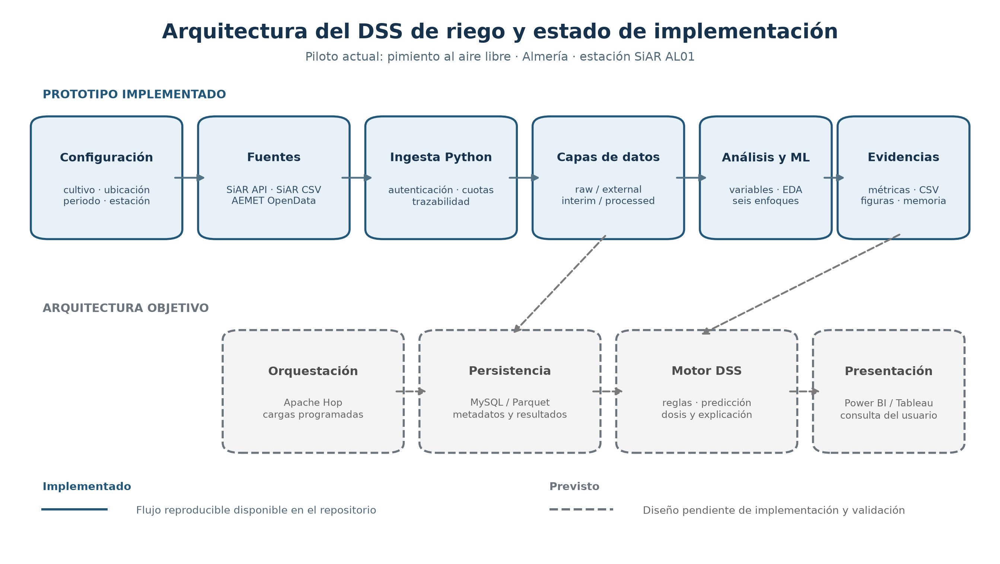

# 3.2. Arquitectura, tecnologías y flujo de información

La arquitectura separa adquisición, almacenamiento, transformación, análisis y
presentación. Esta división evita que los clientes de las APIs, las reglas de
calidad y los modelos queden acoplados a una única interfaz. También permite
repetir una fase sin volver a descargar datos ni sobrescribir la evidencia
original.



*Figura 3.1. Arquitectura del prototipo. Las cajas azules representan
componentes implementados y las cajas discontinuas identifican extensiones
previstas.*

## 3.2.1. Capas de la arquitectura

1. **Configuración.** La ubicación, el cultivo y el periodo se proporcionan como
   parámetros de ejecución. En una fase posterior procederán de la interfaz del
   usuario.
2. **Fuentes.** SiAR aporta observaciones y la referencia agronómica; AEMET
   aporta predicción meteorológica. Cada cliente mantiene autenticación,
   validación de respuestas y tratamiento de cuotas de forma independiente.
3. **Ingesta.** Los procesos Python descargan los productos y escriben un sobre
   de trazabilidad con esquema, fuente, parámetros, fecha de ingesta y número de
   registros.
4. **Almacenamiento por capas.** `raw` conserva las respuestas; `external`
   contiene el CSV agronómico; `interim` almacena tablas normalizadas y controles
   de calidad; `processed` contiene la tabla analítica y las variables derivadas.
5. **Análisis y modelado.** Los módulos de características, análisis exploratorio
   y evaluación consumen la capa `processed`. Los modelos se comparan mediante
   validación temporal y generan métricas, predicciones y figuras.
6. **DSS y presentación.** El motor de recomendación y el cuadro de mando
   utilizarán las predicciones, las reglas agronómicas y los parámetros de la
   parcela. Esta capa todavía está en desarrollo y no se presenta como
   implementada.

El flujo principal es unidireccional y reproducible:

```text
parámetros -> fuentes -> raw/external -> interim -> processed
           -> análisis/modelos -> evidencias -> futuro motor DSS
```

La procedencia se conserva en sentido inverso: una predicción puede relacionarse
con la fila analítica, las tablas normalizadas y el archivo original que la
generó.

## 3.2.2. Tecnologías y grado de implementación

| Tecnología | Función | Estado en el proyecto |
|---|---|---|
| Python | Clientes de APIs, transformación, calidad, características y automatización | Implementado. |
| pandas y NumPy | Tablas, limpieza, agregación y preparación de variables | Implementado. |
| scikit-learn y XGBoost | Pipelines, validación temporal y comparación de modelos | Implementado. |
| Matplotlib | Figuras reproducibles para análisis y memoria | Implementado. |
| Jupyter y Visual Studio Code | Exploración, demostración y desarrollo local | Implementado. |
| Git y GitHub | Versionado, ramas, revisión e integración del trabajo | Implementado. |
| MySQL | Persistencia relacional de catálogos, recomendaciones y metadatos | Diseñado, pendiente de implementación. |
| Apache Hop | Orquestación visual de cargas ETL | Propuesto; el flujo actual se ejecuta con módulos Python. |
| Power BI o Tableau | Interfaz de consulta y visualización final | Previsto para la capa de presentación. |
| Docker | Entorno reproducible de servicios y despliegue | Previsto. |
| PySpark | Procesamiento distribuido si el volumen nacional lo justifica | Condicional; no necesario para el piloto actual. |

Esta clasificación actualiza el planteamiento del anteproyecto. MySQL, Apache
Hop, Docker, PySpark y el cuadro de mando forman parte de la arquitectura
objetivo, pero no se consideran evidencias terminadas. En el estado actual, el
prototipo reproducible se apoya en módulos Python y almacenamiento local por
capas.

## 3.2.3. Contratos de datos e integración

Cada conjunto dispone de una granularidad y una clave lógica. Las observaciones
SiAR se identifican por estación y fecha; las necesidades por estación, cultivo
y fecha; y las predicciones AEMET por municipio, fecha de emisión, horizonte y
fecha válida. Las tablas normalizadas utilizan unidades explícitas en los
nombres de columnas y fechas ISO 8601.

La unión no se realiza únicamente por coincidencia de nombres. Se conservan los
identificadores espaciales y, cuando se incorporen más estaciones, se tendrá en
cuenta distancia, altitud, vigencia y cobertura. Una observación y una
predicción tampoco se consideran equivalentes: la evaluación futura debe
relacionarlas mediante fecha de emisión, fecha válida y horizonte.

## 3.2.4. Reproducibilidad y escalabilidad

Los procesos se ejecutan mediante módulos independientes y generan salidas
deterministas a partir de datos y parámetros conocidos. Las pruebas automáticas
cubren construcción de consultas, protección de credenciales, escritura raw,
normalización, calidad, características y evaluación temporal. Las figuras y
resúmenes de la memoria se regeneran desde los mismos archivos que consume el
modelado.

La separación por capas permite sustituir progresivamente el almacenamiento
local por Parquet, almacenamiento de objetos o MySQL sin cambiar el significado
de las variables. La escalabilidad se abordará cuando exista un histórico de
varias campañas y estaciones. Para el volumen del piloto, pandas es suficiente
y añadir procesamiento distribuido aumentaría la complejidad sin aportar una
mejora demostrable.
