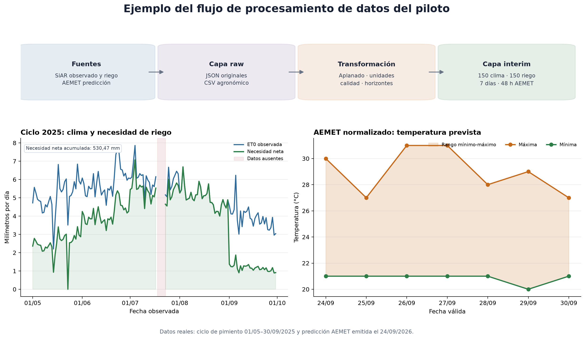

# 4.1. Extracción, transformación y almacenamiento de datos

El sistema de apoyo a la decisión necesita combinar observaciones
agroclimáticas históricas con predicciones meteorológicas. Para ello se ha
diseñado un proceso reproducible de extracción, transformación y almacenamiento
que mantiene separadas las respuestas originales de las tablas preparadas para
el análisis. Esta separación permite auditar cada recomendación, repetir el
procesamiento cuando cambien las reglas y evitar que una corrección destruya el
dato recibido de la fuente.

El piloto utiliza como referencia el pimiento bajo invernadero en Almería. Se ha
extraído un ciclo completo del 1 de mayo al 30 de septiembre de 2025 para la
estación SiAR `AL01` La Mojonera, junto con las necesidades hídricas del
pimiento en esa misma estación y periodo. Las predicciones se obtienen para el
municipio AEMET `04013` Almería. La arquitectura conserva identificadores de
fuente, estación, municipio, cultivo y tiempo para poder ampliarla posteriormente
a otros cultivos y zonas de España.



*Figura 4.1. Flujo implementado desde las fuentes hasta las primeras tablas
normalizadas. Los gráficos inferiores utilizan datos reales de la extracción del
24 de septiembre de 2026.*

## 4.1.1. Fuentes utilizadas

### SiAR

La API del Sistema de Información Agroclimática para el Regadío constituye la
fuente histórica principal. Se han incorporado:

- catálogo de estaciones y sus coordenadas, altitud y vigencia;
- catálogo de códigos de validación;
- datos diarios por estación;
- temperatura, humedad, viento, radiación y precipitación;
- evapotranspiración de referencia Penman-Monteith (`EtPMon`);
- precipitación efectiva calculada (`PePMon`).

La consulta diaria se realiza con `DatosCalculados=true` para obtener ET0 y
precipitación efectiva junto con las variables meteorológicas observadas. Estos
datos representan condiciones exteriores y no miden directamente el microclima
del invernadero.

### AEMET OpenData

AEMET se utiliza como fuente predictiva. Se han incorporado:

- catálogo nacional de municipios;
- inventario de estaciones climatológicas;
- predicción municipal diaria para siete días;
- predicción municipal horaria para aproximadamente 48 horas;
- fecha de elaboración, fecha válida y horizonte de cada predicción;
- temperatura, humedad, precipitación, probabilidad de precipitación, viento,
  rachas y estado del cielo.

La API de AEMET funciona mediante una descarga en dos pasos. La primera respuesta
proporciona una URL temporal oficial y la segunda contiene el JSON meteorológico.
El cliente valida el dominio antes de seguir la URL y no transmite la clave en la
segunda petición.

### Necesidades hídricas de SiAR

La web de SiAR permite descargar CSV con `Kc`, ET0, ETc, precipitación efectiva y
necesidad neta por cultivo y zona. Este producto no dispone de un endpoint
público estable en la API documentada. Se ha incorporado el ciclo del pimiento
para `AL01`, con 150 registros entre mayo y septiembre de 2025. El fichero se
acompaña de metadatos con la consulta, procedencia, estación, comarca, cultivo y
fecha de descarga. Su resultado se utiliza como baseline agronómico y referencia
de validación, no como una medición del riego óptimo real.

## 4.1.2. Extracción

La extracción se implementa en Python mediante clientes independientes para
SiAR y AEMET. Las credenciales se leen desde variables de entorno y nunca se
escriben en los datos, los mensajes de error o el repositorio.

Cada archivo extraído contiene un sobre de trazabilidad con:

- versión del esquema;
- fuente y conjunto de datos;
- fecha y hora de ingestión;
- parámetros de consulta sin credenciales;
- número de registros;
- respuesta de datos recibida.

La escritura es atómica: primero se genera un archivo temporal y solo se sustituye
el destino cuando el JSON está completo. Esto evita archivos parcialmente
escritos si se interrumpe el proceso.

La primera ejecución produjo:

| Fuente | Conjunto | Registros |
|---|---|---:|
| SiAR | Estaciones | 635 |
| SiAR | Códigos de validación | 53 |
| SiAR | Histórico diario de `AL01`, ciclo 2025 | 150 |
| SiAR web | Necesidades hídricas de pimiento en `AL01` | 150 |
| AEMET | Municipios | 8.122 |
| AEMET | Estaciones | 926 |
| AEMET | Predicción diaria | 7 días |
| AEMET | Predicción horaria | 48 horas |

Durante la ejecución se comprobó que el token de SiAR permite un máximo de 100
registros por minuto. Una consulta directa del ciclo completo fue rechazada por
superar la cuota. El histórico se divide por ello en bloques máximos de 90 días,
con una pausa de 60 segundos entre peticiones. Después se ordenan y deduplican
los registros y se escribe un único archivo raw. Los catálogos se descargan de
forma independiente y con una frecuencia inferior a las series meteorológicas.

## 4.1.3. Capa raw

La capa `data/raw` conserva los JSON sin modificar su estructura interna:

```text
data/raw/
├── siar/
│   ├── catalogs/date=AAAA-MM-DD/
│   └── weather/daily/station=AL01/year=AAAA/month=MM/
└── aemet/
    ├── catalogs/date=AAAA-MM-DD/
    └── forecast/
        ├── daily/municipality=04013/ingestion_date=AAAA-MM-DD/
        └── hourly/municipality=04013/ingestion_date=AAAA-MM-DD/
data/external/
└── siar_necesidades_pimiento_AL01_2025.csv
```

La partición por fuente, producto, estación o municipio y fecha permite realizar
cargas incrementales sin sobrescribir ejecuciones anteriores. Los archivos raw
no se almacenan en Git debido a su volumen. El repositorio conserva el código,
las pruebas, los esquemas y la documentación necesarios para reproducirlos.

## 4.1.4. Transformación y normalización

El segundo proceso selecciona la extracción más reciente de cada producto y
genera tablas planas. Las reglas implementadas son:

1. Normalizar nombres en inglés técnico y formato `snake_case`.
2. Mantener unidades explícitas en los nombres de las columnas.
3. Convertir textos numéricos a valores numéricos sin convertir ausencias en
   ceros.
4. Transformar fechas a ISO 8601.
5. Normalizar los códigos municipales a cinco posiciones.
6. Conservar el código original cuando AEMET devuelve `4013` en un producto y
   `04013` en otro.
7. Aplanar las listas horarias para obtener una fila por instante válido.
8. Separar dirección, velocidad y racha del campo heterogéneo
   `vientoAndRachaMax`.
9. Asignar las probabilidades por intervalo a cada hora incluida en el periodo.
10. Calcular `horizon_days` y `horizon_hours` a partir de la fecha de elaboración.
11. Marcar si una hora seguía siendo futura en el momento de publicación.
12. Conservar archivo y fecha de ingestión como columnas de procedencia.
13. Convertir el CSV agronómico con separador `;` y coma decimal sin perder los
    valores ausentes.
14. Comprobar las identidades `ETc ≈ Kc × ET0` y
    `necesidad neta ≈ max(ETc − Pe, 0)` con tolerancia de redondeo.

No se combinan todavía las observaciones SiAR con las predicciones AEMET. Una
observación describe lo que ocurrió y una predicción describe lo que se esperaba
en un momento concreto. La unión para evaluación se realizará posteriormente
mediante fecha válida, fecha de emisión y horizonte.

## 4.1.5. Tablas interim

El proceso genera cinco CSV codificados en UTF-8:

| Tabla | Granularidad | Filas iniciales | Uso previsto |
|---|---|---:|---|
| `siar_weather_daily.csv` | Estación y fecha observada | 150 | Histórico agroclimático. |
| `siar_crop_water_needs_daily.csv` | Estación, cultivo y fecha | 150 | Baseline de necesidad neta de riego. |
| `aemet_forecast_daily.csv` | Municipio, emisión y fecha válida | 7 | Planificación de varios días. |
| `aemet_forecast_hourly.csv` | Municipio, emisión e instante válido | 48 | Decisiones de corto plazo. |
| `quality_summary.csv` | Conjunto de datos | 4 | Control de duplicados, cobertura y avisos. |

Ejemplo de la tabla diaria SiAR:

| Fecha | Temperatura media (°C) | Humedad media (%) | ET0 (mm/día) | Calidad |
|---|---:|---:|---:|---|
| 01/05/2025 | 19,62 | 75,60 | 4,72 | PASS |
| 02/05/2025 | 21,47 | 59,55 | 5,57 | PASS |
| 03/05/2025 | 19,93 | 58,28 | 5,27 | PASS |

Ejemplo de necesidades hídricas del pimiento:

| Fecha | Kc | ET0 (mm) | ETc (mm) | Pe (mm) | Necesidad neta (mm) |
|---|---:|---:|---:|---:|---:|
| 01/05/2025 | 0,50 | 4,72 | 2,36 | 0,00 | 2,36 |
| 01/07/2025 | 0,90 | 6,05 | 5,45 | 0,00 | 5,45 |
| 01/08/2025 | 1,00 | 5,26 | 5,26 | 0,00 | 5,26 |
| 01/09/2025 | 0,30 | 4,56 | 1,37 | 0,00 | 1,37 |

Ejemplo de la predicción diaria AEMET:

| Fecha válida | Horizonte | Tmin (°C) | Tmax (°C) | Probabilidad máxima de lluvia |
|---|---:|---:|---:|---:|
| 24/09/2026 | D+0 | 21 | 30 | 0 % |
| 25/09/2026 | D+1 | 21 | 27 | 0 % |
| 26/09/2026 | D+2 | 21 | 31 | 0 % |
| 28/09/2026 | D+4 | 21 | 28 | 30 % |

## 4.1.6. Controles de calidad

Cada registro recibe `quality_status` y `quality_issues`. Se comprueban:

- presencia de variables críticas;
- orden lógico entre temperatura mínima, media y máxima;
- humedad entre 0 % y 100 %;
- precipitación, viento, radiación y ET0 no negativos;
- probabilidad entre 0 % y 100 %;
- unicidad de las claves lógicas;
- continuidad del calendario entre la primera y la última fecha;
- trazabilidad hasta el archivo raw.

Las 150 fechas meteorológicas y las 150 fechas de necesidades hídricas se
corresponden completamente y no presentan duplicados. La diferencia máxima de
ET0 entre ambas tablas es inferior a 0,005 mm y se explica por el redondeo de la
web. SiAR no devuelve los días 18, 19 y 20 de julio, que quedan registrados como
huecos de calendario. Además, mantiene el 21 y 22 de julio con Kc, pero sin ET0,
ETc, precipitación efectiva ni necesidad neta; ambas filas quedan marcadas como
aviso. En AEMET
horaria se identificaron tres avisos por campos no proporcionados en los extremos
del producto. Los valores ausentes no se sustituyen por cero porque cero y dato
no disponible tienen significados distintos.

El resumen obtenido fue:

| Tabla | Filas | Duplicados | Filas con avisos | Fechas ausentes |
|---|---:|---:|---:|---:|
| SiAR diaria | 150 | 0 | 2 | 3 |
| Necesidades hídricas de pimiento | 150 | 0 | 2 | 3 |
| AEMET diaria | 7 | 0 | 0 | 0 |
| AEMET horaria | 48 | 0 | 3 | n.a. |

## 4.1.7. Almacenamiento y escalabilidad

Los CSV de la capa interim facilitan la inspección inicial y el intercambio de
muestras. Para una extracción nacional o un histórico extenso se propone migrar
las tablas a Parquet, particionado por fuente, estación o municipio y año-mes.
Parquet reduce espacio, conserva tipos y permite leer solo las columnas y
particiones necesarias.

La futura base MySQL almacenará catálogos, recomendaciones y metadatos que deban
consultarse transaccionalmente. Los históricos voluminosos y artefactos de modelo
podrán permanecer en almacenamiento de objetos. Esta separación evita utilizar
la base transaccional como repositorio de archivos y mantiene una arquitectura
compatible con ejecución local y despliegue cloud.

## 4.1.8. Reproducibilidad y seguridad

El proceso se reproduce mediante:

```powershell
python -m src.data.extract_pilot
python -m src.data.extract_siar_history --start-date 2025-05-01 --end-date 2025-09-30
python -m src.data.transform_interim
python -m src.visualization.build_etl_visual
```

Las pruebas automatizadas verifican construcción de consultas, fechas, descarga
en dos pasos, ocultación de credenciales, validación de URLs, estructura de los
archivos raw, normalización de códigos, cálculo de horizontes y aplanado de viento
y rachas.

Las credenciales se guardan únicamente en `.env`, excluido de Git. El archivo
`.env.example` documenta los nombres de las variables sin incluir valores reales.

## 4.1.9. Limitaciones

El ciclo completo permite validar la integración, pero un único año y una sola
estación todavía no son suficientes para entrenar un modelo generalizable. Antes
del modelado se deberán añadir varias campañas y, si el alcance lo exige, otras
estaciones de Almería. También se verificará la unidad contractual de cada
variable con la documentación oficial. SiAR y AEMET representan condiciones
exteriores, por lo que las recomendaciones para invernadero deberán declarar
esta limitación e incorporar sensores interiores cuando estén disponibles.
