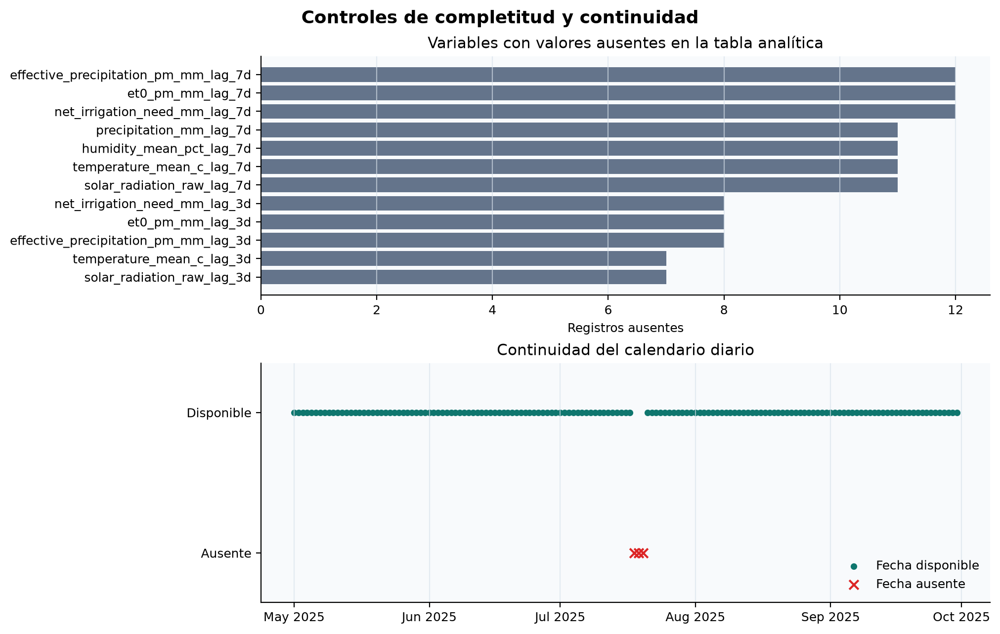
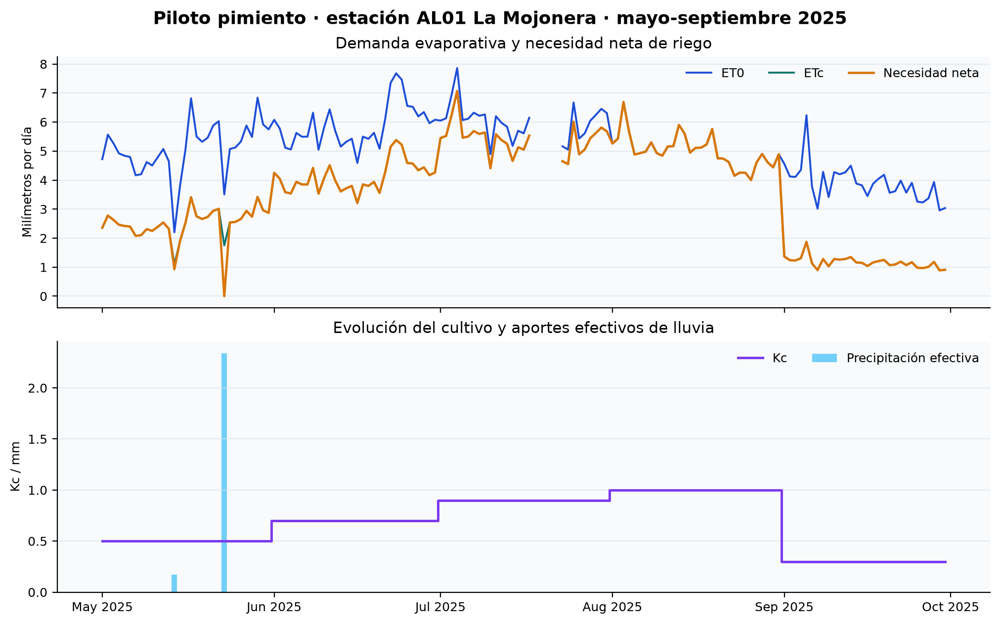
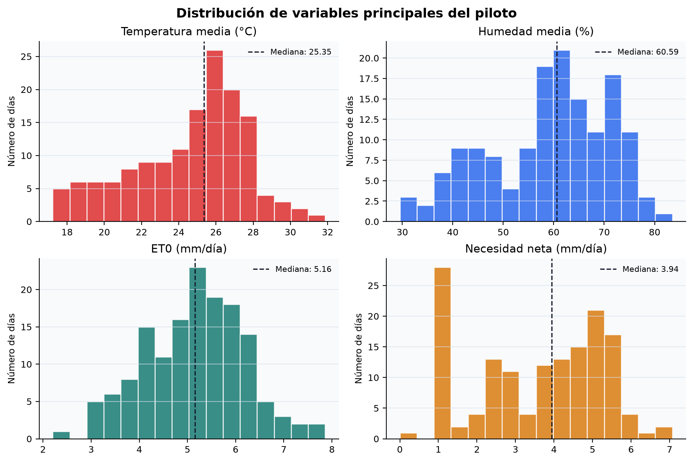
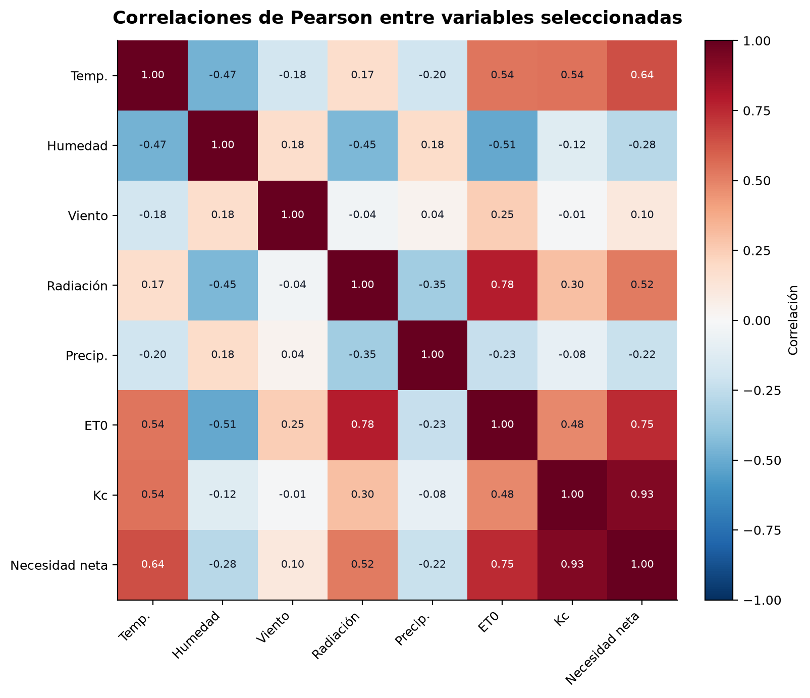

# 4.2. Análisis exploratorio y preparación de variables

El análisis exploratorio conecta las tablas normalizadas del apartado 4.1 con el desarrollo del modelo del apartado 4.3. Su objetivo es comprobar la cobertura y coherencia de los datos, describir el comportamiento de las variables, preparar una tabla analítica diaria y definir qué información puede utilizarse en una predicción real sin introducir fuga de información. El proceso se ha implementado de forma reproducible en `src/analysis/build_eda_4_2.py`, apoyándose en las transformaciones de `src/features/feature_engineering.py`.

## 4.2.1. Alcance y unidad de análisis

El piloto utiliza el cultivo de pimiento y la estación SiAR `AL01` La Mojonera, en Almería, entre el 1 de mayo y el 30 de septiembre de 2025. La unidad de análisis es una combinación de fecha, estación y cultivo. Las tablas meteorológica y agronómica se unen por `station_code` y `observed_date`; el cultivo se conserva como parte de la clave analítica. El resultado contiene 150 registros y 88 columnas entre variables de origen, controles de calidad, atributos derivados, retardos y ventanas temporales.

| Indicador | Resultado |
| --- | ---: |
| Periodo esperado | 01/05/2025–30/09/2025 |
| Días naturales esperados | 153 |
| Días observados | 150 |
| Fechas ausentes | 18, 19 y 20 de julio de 2025 |
| Claves duplicadas | 0 |
| Filas con estado `PASS` | 148 |
| Filas con estado `WARN` | 2 |
| Valores válidos de la variable objetivo | 148 |

Los tres días ausentes se conservan como huecos de calendario. No se rellenan automáticamente porque una interpolación podría crear condiciones meteorológicas y necesidades de riego que no fueron observadas. El cálculo de retardos reindexa cada serie a frecuencia diaria antes de aplicar `shift`, por lo que una observación separada por un hueco no se trata como si perteneciera al día inmediatamente anterior. Las dos filas `WARN` presentan ausencia de ET0 y de las magnitudes derivadas; se mantienen para trazabilidad, pero deberán excluirse o tratarse dentro de cada partición de entrenamiento.

**Figura 4.2.** Valores ausentes y continuidad del calendario en la tabla analítica del piloto. Fuente: elaboración propia a partir de SiAR.

Los controles de plausibilidad no detectaron humedades fuera del intervalo 0–100 %, valores negativos en ET0, precipitación o necesidad neta, ni incumplimientos del orden temperatura mínima ≤ media ≤ máxima. Esto no demuestra por sí solo la validez agronómica de cada medición, pero permite descartar errores básicos de rango y signo antes del modelado.

## 4.2.2. Análisis descriptivo y temporal

La necesidad neta de riego diaria presenta 148 observaciones válidas, una media de 3,59 mm/día, mediana de 3,94 mm/día, desviación típica de 1,67 mm/día y valores entre 0,00 y 7,07 mm/día. La suma de la referencia SiAR durante los días disponibles asciende a 531,05 mm. La ET0 media es 5,15 mm/día y el coeficiente de cultivo medio es 0,68.

| Variable | N válido | Media | Mediana | Mínimo | Máximo |
| --- | ---: | ---: | ---: | ---: | ---: |
| Temperatura media (°C) | 149 | 24,57 | 25,35 | 17,23 | 31,87 |
| Humedad media (%) | 149 | 59,07 | 60,59 | 29,51 | 83,50 |
| ET0 (mm/día) | 148 | 5,15 | 5,16 | 2,20 | 7,86 |
| Coeficiente de cultivo Kc | 150 | 0,68 | 0,70 | 0,30 | 1,00 |
| Necesidad neta (mm/día) | 148 | 3,59 | 3,94 | 0,00 | 7,07 |

La serie temporal muestra que la necesidad neta no depende únicamente del clima. También cambia con las etapas del cultivo representadas por Kc. Durante el periodo de mayor desarrollo, Kc alcanza 1,00 y la necesidad neta se aproxima a la ET0; al final del ciclo, Kc desciende a 0,30 y la demanda calculada disminuye aunque continúe la evapotranspiración de referencia. La precipitación efectiva es escasa y concentrada, por lo que reduce la necesidad neta de forma puntual.

**Figura 4.3.** Evolución de ET0, ETc, necesidad neta, Kc y precipitación efectiva. Fuente: elaboración propia a partir de SiAR.

**Figura 4.4.** Distribución de temperatura, humedad, ET0 y necesidad neta. Fuente: elaboración propia a partir de SiAR.

## 4.2.3. Relaciones entre variables

El análisis de correlaciones de Pearson aporta una primera descripción lineal, sin interpretarse como causalidad. La necesidad neta se relaciona de forma positiva con Kc (0,93), ET0 (0,75), temperatura media (0,64) y radiación solar (0,52), y de forma negativa con humedad media (-0,28) y precipitación (-0,22). Las relaciones coinciden con la formulación agronómica de la referencia, ya que ETc se obtiene a partir de ET0 y Kc, y la precipitación efectiva reduce la necesidad neta.

**Figura 4.5.** Matriz de correlaciones de Pearson para variables seleccionadas. Fuente: elaboración propia a partir de SiAR.

La elevada correlación de Kc y ET0 con el objetivo no debe presentarse como un descubrimiento independiente: forma parte de la manera en que SiAR calcula la propia etiqueta. Por esta razón, ETc y la precipitación efectiva contemporáneas se reservan para comprobaciones y no se incorporan como predictores directos de un modelo que pretenda anticipar la necesidad futura.

## 4.2.4. Preparación y generación de variables

La tabla final combina cuatro grupos de información:

1. **Variables temporales.** Año, mes, semana ISO, día del año y codificación cíclica mediante seno y coseno. Esta última representa la estacionalidad sin introducir una ruptura artificial entre el final y el inicio del año.
2. **Variables agrometeorológicas derivadas.** Amplitud térmica diaria, déficit de presión de vapor, ETc estimada como `ET0 × Kc` y necesidad neta diagnóstica como `max(ETc − precipitación efectiva, 0)`.
3. **Retardos.** Valores de 1, 3 y 7 días de ET0, precipitación, temperatura, humedad, radiación y necesidad neta.
4. **Ventanas temporales.** Medias móviles de 3, 7 y 14 días para variables continuas, y sumas móviles para precipitación, precipitación efectiva y necesidad neta. Todas las ventanas se desplazan un día antes de calcularse, de modo que no utilizan el valor que se desea predecir.

La variable objetivo se denomina `target_net_irrigation_need_mm` y corresponde a la necesidad neta diaria calculada por SiAR. Se trata de una etiqueta agronómica de referencia, no del riego realmente aplicado en una explotación. En consecuencia, el modelo del apartado 4.3 medirá su capacidad para reproducir o anticipar dicha referencia. La validación en campo y los registros reales de riego quedan como una ampliación necesaria para evaluar ahorro de agua, productividad o impacto económico.

## 4.2.5. Disponibilidad de variables y prevención de fuga de información

Para que la evaluación sea realista se distingue entre información conocida de antemano, observaciones disponibles al cierre del día y variables que solo existen después de calcular el objetivo.

| Grupo | Ejemplos | Uso propuesto |
| --- | --- | --- |
| Conocidas de antemano | cultivo, estación, fecha, Kc planificado | Candidatas para predicción |
| Meteorología observada | temperatura, humedad, viento, radiación, ET0 | Prototipo retrospectivo o *nowcast*; para futuro debe sustituirse por pronóstico |
| Históricas desplazadas | retardos y ventanas hasta t−1 | Candidatas si están disponibles en producción |
| Derivadas contemporáneas del objetivo | ETc, precipitación efectiva usada por SiAR, necesidad neta reconstruida | Solo diagnóstico; excluir del entrenamiento predictivo |
| Calidad y trazabilidad | estados, incidencias, fichero y fecha de ingesta | Auditoría; no predictores |

El catálogo `docs/data_samples/feature_catalog_4_2.csv` documenta las 88 columnas, su tipo, disponibilidad, porcentaje de ausencias, función y riesgo de fuga. Este control será la base para seleccionar las variables del apartado 4.3. También evita que un buen resultado aparente provenga de introducir en el modelo componentes que determinan algebraicamente la etiqueta.

La muestra AEMET disponible no se incorpora al entrenamiento: corresponde a una predicción emitida en septiembre de 2026 y no coincide temporalmente con el ciclo SiAR de 2025. Sirve como prueba de integración del sistema operacional. Para entrenar un modelo de recomendación futura será necesario obtener predicciones meteorológicas históricas emitidas antes de cada fecha objetivo o definir un escenario de prototipo retrospectivo basado exclusivamente en observaciones SiAR.

## 4.2.6. Estrategia de preparación para el modelado

La división de entrenamiento, validación y prueba debe respetar el orden temporal. Una partición aleatoria mezclaría días muy próximos de la misma campaña y produciría una estimación optimista del error. En este piloto se propone entrenar con el tramo inicial y evaluar con fechas posteriores; cuando se amplíe el histórico, deberán reservarse campañas completas y, posteriormente, estaciones completas para medir generalización temporal y espacial.

Las imputaciones y escalados se ajustarán únicamente con el conjunto de entrenamiento. Las filas sin objetivo no pueden utilizarse para supervisar el modelo. Los retardos generarán ausencias esperadas al inicio de la serie y después de huecos del calendario; dichas ausencias se tratarán mediante un `Pipeline` reproducible, sin reemplazarlas por cero salvo que el significado agronómico lo justifique.

El conjunto actual es suficiente para verificar el flujo técnico, crear una línea base y detectar problemas de integración. No es suficiente para afirmar que el modelo se generaliza a otras campañas, estaciones, zonas o cultivos: solo existen una estación, un cultivo, una campaña y 148 etiquetas válidas. Esta limitación condicionará la interpretación de las métricas del apartado 4.3.

## 4.2.7. Resultados reproducibles

La ejecución de `python -m src.analysis.build_eda_4_2` genera:

- `data/processed/modeling_dataset_daily.csv`, tabla completa para modelización, excluida de Git por tratarse de un dato generado.
- `docs/data_samples/eda_summary_4_2.json`, resumen verificable de cobertura, calidad, objetivo y correlaciones.
- `docs/data_samples/eda_variable_summary_4_2.csv`, estadísticos descriptivos de las variables principales.
- `docs/data_samples/feature_catalog_4_2.csv`, catálogo de variables y control de fuga.
- `docs/data_samples/modeling_dataset_sample_4_2.csv`, muestra ligera de la tabla preparada.
- Cuatro figuras en `docs/images/` que documentan series, distribuciones, correlaciones y calidad.

Con ello, el apartado 4.2 queda cerrado como un proceso repetible: parte de las tablas normalizadas, documenta sus limitaciones, genera variables temporales y agronómicas, distingue la disponibilidad real de cada predictor y produce una tabla preparada para la comparación de modelos del apartado 4.3.
