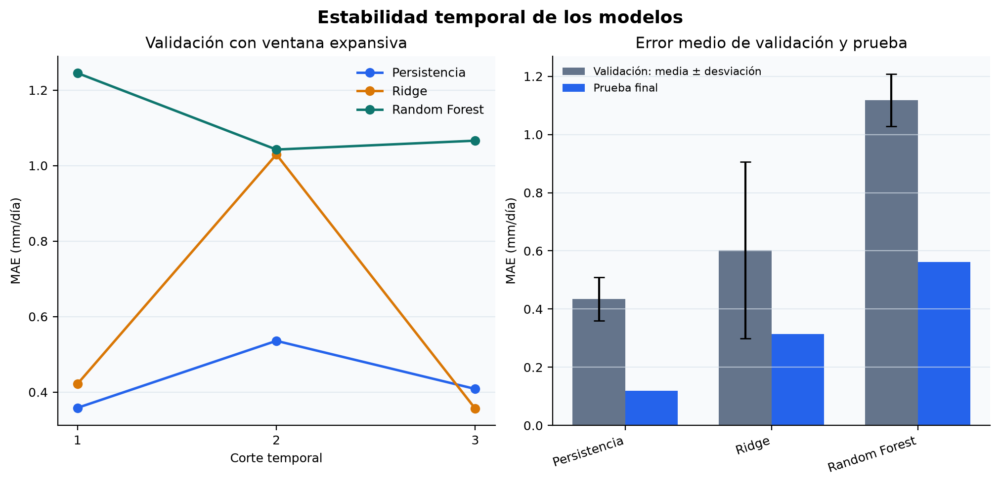
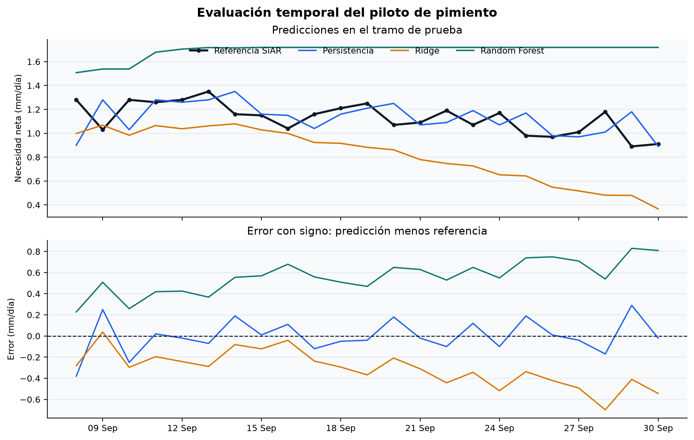

# 4.3. Desarrollo y evaluación del modelo predictivo

El objetivo de esta fase es comprobar si un modelo puede anticipar la necesidad
neta diaria de riego publicada por SiAR para el piloto de pimiento en la
estación `AL01` La Mojonera. La variable objetivo,
`target_net_irrigation_need_mm`, es una referencia agronómica calculada y no una
medición del riego aplicado ni de la respuesta real del cultivo. Por ello, el
experimento demuestra la viabilidad del flujo de modelización del DSS, pero no
permite afirmar todavía que se optimice el consumo de agua.

## 4.3.1. Conjunto de modelización y prevención de fuga de información

El entrenamiento consume directamente la tabla analítica construida en el
apartado 4.2 (`data/processed/modeling_dataset_daily.csv`). Así se mantiene la
trazabilidad entre extracción, preparación y modelización, y se evita repetir
transformaciones con criterios diferentes. De los 150 días del ciclo, 148
disponen de objetivo válido y participan en el experimento.

Los nueve predictores utilizados son el coeficiente de cultivo conocido para
la fecha; la codificación cíclica del día del año; los retardos de 1, 3 y 7 días
de la necesidad neta; y sus acumulados históricos de 3, 7 y 14 días. Todos
ellos están disponibles antes del día que se desea estimar. Los retardos se
calculan por fecha de calendario: si falta el día anterior, el retardo de un
día queda ausente y no se sustituye por la última fila disponible.

Se excluyen expresamente la ET0, la ETc y la precipitación efectiva del mismo
día, así como las variables diagnósticas derivadas de ellas. La referencia SiAR
se aproxima mediante `max(ET0 × Kc − Pe, 0)`; incluir esos campos permitiría
reconstruir el objetivo de forma algebraica y produciría métricas aparentemente
buenas sin capacidad predictiva real. Los valores ausentes restantes se imputan
con la mediana aprendida exclusivamente en cada periodo de entrenamiento.

## 4.3.2. Diseño de validación temporal

La evaluación mantiene el orden cronológico. Los últimos 23 registros, del 8
al 30 de septiembre de 2025, se reservan como prueba final y no intervienen en
la selección. Las 125 observaciones anteriores forman el periodo de desarrollo.
Sobre este periodo se aplica una validación temporal con tres cortes y ventana
expansiva: cada modelo aprende únicamente con el pasado y se valida sobre el
bloque inmediatamente posterior.

Este diseño es más robusto que escoger un modelo mediante una sola partición,
porque permite observar si su rendimiento se mantiene a medida que avanza el
ciclo del cultivo. El bloque de prueba se consulta una sola vez después de
seleccionar el enfoque con menor MAE medio de validación. Se fija la semilla 42
y las predicciones se limitan a un mínimo físico de 0 mm/día.

## 4.3.3. Enfoques comparados

Se comparan tres alternativas con distinta complejidad:

1. **Persistencia:** repite la necesidad observada el día anterior. Es el
   baseline temporal mínimo que un modelo más complejo debe superar.
2. **Regresión Ridge:** modelo lineal regularizado, precedido por imputación y
   estandarización. Aporta una referencia interpretable y reduce el riesgo de
   sobreajuste.
3. **Random Forest:** conjunto de 300 árboles, con profundidad máxima de cinco
   niveles y un mínimo de cuatro muestras por hoja. Representa relaciones no
   lineales con una configuración conservadora para el tamaño muestral.

La persistencia se incluye en el mismo procedimiento de selección que los
modelos de aprendizaje. Esto evita desplegar un algoritmo más complejo si no
aporta una mejora estable y medible.

## 4.3.4. Métricas de evaluación

El MAE diario es la métrica principal porque se interpreta directamente en
milímetros y es menos sensible que el RMSE a episodios extremos. Se añaden el
RMSE diario, el sesgo medio —positivo cuando se sobreestima y negativo cuando
se infraestima— y el MAE de los acumulados semanales. Esta última métrica es
coherente con el DSS, que debe ofrecer recomendaciones diarias y semanales.

## 4.3.5. Resultados de validación

**Tabla 4.10. Rendimiento medio en los tres cortes de validación temporal.**

| Enfoque | MAE diario (media ± desv.) | RMSE diario | Sesgo diario | MAE semanal |
|---|---:|---:|---:|---:|
| Persistencia | **0,434 ± 0,075** | **0,644** | **0,013** | **0,926** |
| Ridge | 0,602 ± 0,303 | 0,742 | 0,292 | 2,803 |
| Random Forest | 1,118 ± 0,090 | 1,385 | -0,432 | 6,396 |

La persistencia obtiene el menor MAE medio y presenta una variabilidad menor
que Ridge. Ridge solo supera ligeramente al baseline en el tercer corte
(0,356 frente a 0,408 mm/día), pero su MAE aumenta hasta 1,029 mm/día en el
segundo. Random Forest no supera al baseline en ninguno de los tres periodos.
La Figura 4.6 hace visible esta inestabilidad y justifica seleccionar la
persistencia antes de consultar la prueba final.



## 4.3.6. Evaluación sobre el tramo de prueba

**Tabla 4.11. Resultados sobre el periodo de prueba reservado.**

| Enfoque | MAE diario | RMSE diario | Sesgo diario | MAE semanal |
|---|---:|---:|---:|---:|
| Persistencia | **0,120** | **0,156** | **-0,000** | **0,172** |
| Ridge | 0,314 | 0,352 | -0,310 | 1,784 |
| Random Forest | 0,562 | 0,583 | 0,562 | 3,232 |

El orden observado en validación se conserva en prueba. La persistencia sigue
de cerca la referencia SiAR y no presenta sesgo apreciable. Ridge tiende a
infraestimar conforme avanza septiembre, mientras que Random Forest mantiene
una sobreestimación sistemática. La Figura 4.7 muestra las predicciones y el
error con signo de cada enfoque.



## 4.3.7. Decisión e interpretación

Con la evidencia disponible, la decisión técnica es mantener la persistencia
como referencia predictiva del piloto y no desplegar Ridge ni Random Forest.
Esto no significa que el aprendizaje automático carezca de utilidad, sino que
la muestra actual —un único ciclo, cultivo y estación— no contiene información
suficiente para demostrar una mejora estable frente a una serie muy
autocorrelacionada.

El resultado también evita confundir dos funciones del DSS. La fórmula SiAR
sigue siendo el baseline agronómico explicable para calcular la necesidad
cuando se conocen las variables meteorológicas del día. La persistencia es el
baseline predictivo para anticiparla con información pasada. Un modelo futuro
deberá superar ambos referentes en el contexto de uso que le corresponda.

## 4.3.8. Limitaciones y evolución prevista

La etiqueta reproduce una referencia calculada y no incorpora humedad del
suelo, microclima del invernadero, eficiencia de la instalación, riego aplicado,
drenaje, rendimiento ni estrés del cultivo. Además, la meteorología AEMET
disponible no coincide temporalmente con el ciclo usado para entrenar. Por ello,
las métricas no demuestran ahorro de agua ni generalización a otras parcelas.

Antes de reconsiderar el despliegue se deben incorporar varias campañas y
estaciones, alinear datos meteorológicos históricos y pronosticados, y registrar
riego real y sensores de parcela. Una evolución coherente consiste en estimar
primero la ET0 futura con predicciones meteorológicas y, cuando existan
observaciones agronómicas suficientes, aprender una corrección sobre el
baseline físico. La comparación deberá repetirse por campaña y estación,
manteniendo grupos temporales independientes.

## 4.3.9. Reproducibilidad y evidencias

El flujo se implementa en `src/models/train_evaluate.py` y se ejecuta con:

```powershell
python -m src.models.train_evaluate
```

El comando genera el informe completo de validación y prueba
(`docs/data_samples/model_evaluation_4_3.json`), las 23 predicciones finales
(`docs/data_samples/model_predictions_4_3.csv`), las Figuras 4.6 y 4.7 y el
modelo serializado localmente. Este último se excluye de Git por ser un
artefacto reproducible. Las pruebas automatizadas verifican el orden temporal,
el tratamiento de huecos, la reutilización de variables del 4.2, la exclusión
de variables con fuga, la restricción no negativa y la reproducibilidad.
